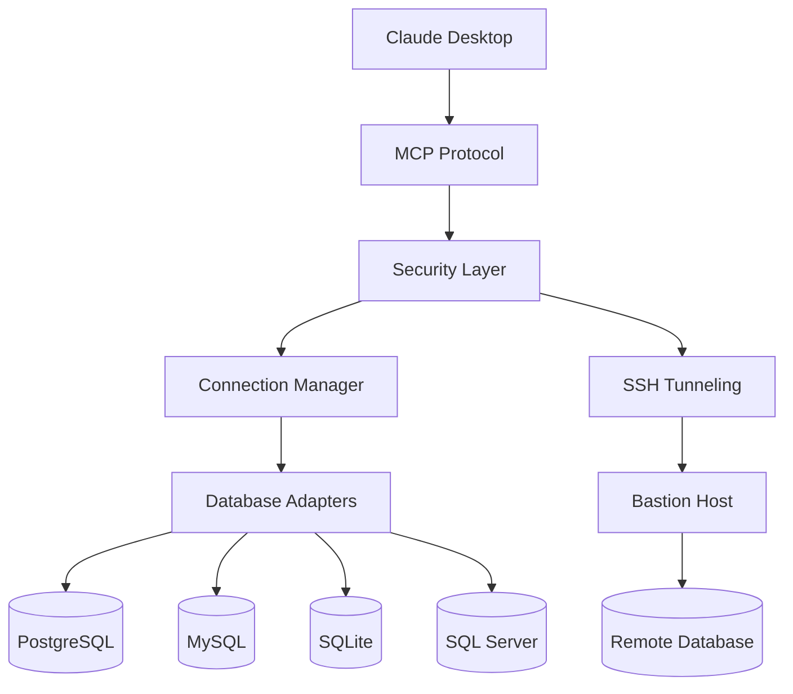

# MCP SQL Access Server v2.1.0

[](https://www.typescriptlang.org/)
[](https://github.com/your-org/sql-ts)
[](https://opensource.org/licenses/MIT)
[](https://github.com/your-org/sql-ts)

🚀 **Enterprise-grade MCP SQL Access Server v2.1.0** - Connect Claude Desktop to your databases with bulletproof security, comprehensive monitoring, and seamless multi-database support.

## ✨ Why Choose MCP SQL Access Server v2.0.0?

### 🛡️ **Security First**
- **SELECT-Only Mode** - Production-safe read-only database access
- **Query Validation** - Advanced SQL injection prevention and complexity analysis
- **SSH Tunneling** - Secure encrypted connections through bastion hosts
- **Audit Logging** - Comprehensive security event tracking

### ⚡ **High Performance** 
- **Connection Pooling** - Efficient database connection management
- **Schema Caching** - Lightning-fast metadata access
- **Query Optimization** - Built-in performance analysis and recommendations
- **Batch Operations** - Execute multiple queries with transaction support

### 🗄️ **Universal Database Support**
- **PostgreSQL** - Full support including advanced features
- **MySQL/MariaDB** - Complete compatibility with all versions
- **SQLite** - Perfect for development and small applications
- **SQL Server** - Enterprise-grade Microsoft SQL Server support

### 🔧 **Developer Experience**
- **5-Minute Setup** - Interactive configuration wizard
- **TypeScript Native** - Full type safety and IntelliSense support
- **Comprehensive Docs** - Detailed guides, tutorials, and API reference
- **Extensive Testing** - Unit, integration, and end-to-end test coverage

## 🚀 Quick Start

### 1. Install
```bash
npm install -g sql-access
```

### 2. Configure
```bash
sql-setup
```
The interactive wizard guides you through database setup, security configuration, and SSH tunneling.

### 3. Start
```bash
sql-server
```

### 4. Connect Claude Desktop
Add to your Claude Desktop configuration:
```json
{
  "mcpServers": {
    "sql-database": {
      "command": "sql-server",
      "args": []
    }
  }
}
```

**That's it!** 🎉 Claude now has secure access to your databases.

## 🎯 Use Cases

### 📊 **Data Analytics & Business Intelligence**
> "Show me the top 10 customers by revenue this quarter, including their growth rate compared to last quarter"

### 🏢 **Production Database Monitoring**
> "Check the status of our user registration system - how many signups in the last 24 hours and any error patterns?"

### 🔍 **Database Administration**
> "Analyze the performance of our product catalog queries and suggest optimizations"

### 🧪 **Development & Testing**
> "Generate test data scenarios based on our current user demographics"

## 🏗️ Architecture



**Built on solid foundations:**
- **TypeScript** - Full type safety and modern development experience
- **Node.js** - Cross-platform compatibility and excellent ecosystem
- **MCP Protocol** - Standard protocol for AI tool integration
- **Industry-standard drivers** - Proven database connectivity libraries

## 📚 Documentation Hub

### 🚀 **Getting Started**
- **[5-Minute Quick Start](docs/guides/quick-start.md)** - Get running fast
- **[Installation Guide](docs/guides/installation-guide.md)** - Detailed setup instructions
- **[First Database Tutorial](docs/tutorials/02-first-database.md)** - Connect your first database
- **[Claude Integration](docs/tutorials/03-claude-integration.md)** - Set up Claude Desktop

### 🏗️ **Architecture & Design**
- **[System Architecture](docs/architecture/system-architecture.md)** - How it all works together
- **[Security Architecture](docs/architecture/security-architecture.md)** - Defense-in-depth security model
- **[Database Layer](docs/architecture/database-layer.md)** - Adapter pattern implementation

### 📖 **API Reference**
- **[MCP Tools Reference](docs/api/mcp-tools-reference.md)** - Complete tool documentation
- **[TypeScript API](docs/api/typescript-api.md)** - Developer API reference
- **[Configuration Reference](docs/guides/configuration-guide.md)** - All configuration options

### 🎯 **Advanced Guides**
- **[Multi-Database Setup](docs/tutorials/advanced-01-multi-database.md)** - Managing multiple databases
- **[SSH Tunneling](docs/tutorials/advanced-02-ssh-tunnels.md)** - Secure remote access
- **[Security Hardening](docs/operations/security-hardening.md)** - Production security guide
- **[Performance Tuning](docs/operations/performance-tuning.md)** - Optimization strategies

**[📖 Browse All Documentation →](docs/README.md)**

## 🔧 Configuration Examples

### Production PostgreSQL with SSH
```ini
[database.production]
type=postgresql
host=internal-db.company.local
port=5432
database=production_app
username=readonly_user
password=secure_random_password
ssl=true
select_only=true
timeout=15000

# SSH Tunnel Configuration
ssh_host=bastion.company.com
ssh_port=22
ssh_username=tunnel_user
ssh_private_key=/secure/path/ssh_key

[security]
max_joins=5
max_subqueries=3
max_complexity_score=50
```

### Multi-Database Analytics Setup
```ini
[database.transactions]
type=postgresql
host=transactions-db.company.com
database=transactions
select_only=true

[database.users]
type=mysql
host=users-db.company.com
database=users
select_only=true

[database.analytics]
type=sqlite
file=./data/analytics.sqlite
select_only=false

[extension]
max_rows=1000
query_timeout=30000
```

## 🔒 Security Features

### Multi-Layer Security Model
1. **Query Validation** - SQL injection prevention and syntax analysis
2. **Complexity Limits** - Prevent resource-intensive queries
3. **SELECT-Only Mode** - Read-only database access for production safety
4. **Connection Encryption** - SSL/TLS and SSH tunnel support
5. **Audit Logging** - Comprehensive security event tracking

### Enterprise Security Compliance
- **SOC 2 Type II** compatible logging and monitoring
- **GDPR/CCPA** compliant data access controls
- **HIPAA** suitable with proper configuration
- **PCI DSS** compatible for payment data environments

## 🚀 Performance

### Benchmarks
| Operation | PostgreSQL | MySQL | SQLite | SQL Server |
|-----------|------------|-------|--------|------------|
| Simple SELECT | ~5ms | ~4ms | ~1ms | ~6ms |
| Complex JOIN | ~45ms | ~40ms | ~8ms | ~50ms |
| Schema Capture | ~150ms | ~120ms | ~30ms | ~180ms |
| Connection Setup | ~80ms | ~60ms | ~5ms | ~100ms |

### Performance Features
- **Connection Pooling** - Reuse database connections efficiently
- **Schema Caching** - Instant metadata access after initial capture
- **Query Optimization** - Built-in EXPLAIN plan analysis
- **Result Streaming** - Handle large datasets efficiently
- **Batch Operations** - Execute multiple queries optimally

## 🛠️ Development

### Development Setup
```bash
git clone <repository-url>
cd sql-ts
npm install
npm run dev
npm test
```

**[📖 Full Development Guide →](docs/development/development-setup.md)**

## 📄 License

This project is licensed under the **MIT License**.

### Open Source Commitment
- ✅ **Always free** for individual developers and small teams
- ✅ **No vendor lock-in** - use with any Claude deployment
- ✅ **Transparent** development process and roadmap

## 🙏 Acknowledgments

### Built With ❤️
- **TypeScript** - Language and tooling
- **Node.js** - Runtime platform  
- **Jest** - Testing framework
- **ESLint** - Code quality
- **MCP Protocol** - AI integration standard

### Special Thanks
- **[Anthropic](https://anthropic.com)** - For Claude AI and MCP protocol
- **[TypeScript Team](https://www.typescriptlang.org/)** - For excellent tooling
- **Database Driver Maintainers** - For reliable connectivity libraries

---

<div align="center">

**[🚀 Get Started Now](docs/guides/quick-start.md)** • **[📖 Documentation](docs/README.md)**

*Transform your database interactions with AI-powered SQL intelligence*

</div>