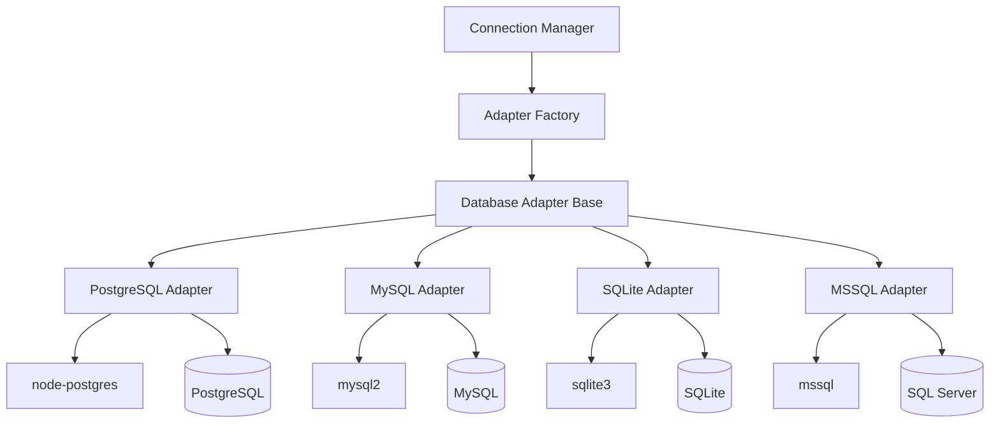
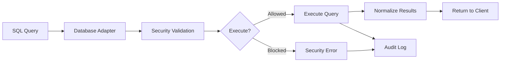

# Database Layer Architecture

The Database Layer implements a flexible, extensible adapter pattern that provides unified access to multiple database systems while maintaining database-specific optimizations. This document details the architecture, design patterns, and implementation strategies.

## Design Goals

1. **Unified Interface**: Single API for all database operations regardless of underlying database
2. **Type Safety**: Full TypeScript type safety across all database adapters 
3. **Performance**: Database-specific optimizations without sacrificing consistency
4. **Extensibility**: Easy addition of new database support
5. **Reliability**: Robust error handling and connection management
6. **Security**: Consistent security model across all databases

## Architecture Overview



## Component Structure

### Core Components

```
src/database/
+-- adapters/
|   +-- base.ts # Abstract adapter base class
|   +-- index.ts # Factory and exports
|   +-- postgresql.ts # PostgreSQL implementation
|   +-- mysql.ts # MySQL implementation
|   +-- sqlite.ts # SQLite implementation
|   +-- mssql.ts # SQL Server implementation
+-- types/ # Database-specific types
```

## Adapter Pattern Implementation

### Abstract Base Class

The `DatabaseAdapter` abstract class defines the contract that all database adapters must implement:

```typescript
export abstract class DatabaseAdapter {
 protected config: DatabaseConfig;
 protected connectionTimeout: number;

 // Abstract methods - must be implemented
 abstract connect(): Promise<DatabaseConnection>;
 abstract executeQuery(connection: DatabaseConnection, query: string, params?: unknown[]): Promise<QueryResult>;
 abstract disconnect(connection: DatabaseConnection): Promise<void>;
 abstract captureSchema(connection: DatabaseConnection): Promise<DatabaseSchema>;
 abstract isConnected(connection: DatabaseConnection): boolean;
 abstract beginTransaction(connection: DatabaseConnection): Promise<void>;
 abstract commitTransaction(connection: DatabaseConnection): Promise<void>;
 abstract rollbackTransaction(connection: DatabaseConnection): Promise<void>;
 abstract buildExplainQuery(query: string): string;

 // Common implementations
 public getType(): DatabaseTypeString;
 public getConfig(): DatabaseConfig;
 protected validateConfig(requiredFields: string[]): void;
 protected normalizeQueryResult(rawResult: unknown, startTime: number): QueryResult;
 // ... more helper methods
}
```

### Adapter Factory

The `AdapterFactory` provides centralized adapter creation and configuration validation:

```typescript
export class AdapterFactory {
 static createAdapter(config: DatabaseConfig): DatabaseAdapter {
 const type = config.type.toLowerCase();
 
 switch (type) {
 case 'mysql':
 return new MySQLAdapter(config);
 case 'postgresql':
 case 'postgres':
 return new PostgreSQLAdapter(config);
 case 'sqlite':
 return new SQLiteAdapter(config);
 case 'mssql':
 case 'sqlserver':
 return new MSSQLAdapter(config);
 default:
 throw new Error(`Unsupported database type: ${config.type}`);
 }
 }
 
 static validateConfig(config: DatabaseConfig): ValidationResult;
 static getRequiredFields(type: DatabaseTypeString): string[];
 static getDefaultPort(type: DatabaseTypeString): number;
}
```

## Database-Specific Implementations

### PostgreSQL Adapter Features

```typescript
export class PostgreSQLAdapter extends DatabaseAdapter {
 // Connection with advanced PostgreSQL features
 async connect(): Promise<Client> {
 const client = new Client({
 host: this.config.host,
 port: this.config.port || 5432,
 database: this.config.database,
 user: this.config.username,
 password: this.config.password,
 ssl: this.config.ssl ? { rejectUnauthorized: false } : false,
 connectionTimeoutMillis: this.connectionTimeout,
 query_timeout: this.connectionTimeout,
 statement_timeout: this.connectionTimeout
 });

 await client.connect();
 return client;
 }

 // PostgreSQL-specific EXPLAIN query
 buildExplainQuery(query: string): string {
 return `EXPLAIN (FORMAT JSON, ANALYZE true, BUFFERS true) ${query}`;
 }

 // Advanced schema capture with PostgreSQL metadata
 async captureSchema(connection: Client): Promise<DatabaseSchema> {
 const schema = this.createBaseSchema(this.config.database || 'unknown');
 
 // Capture tables with PostgreSQL-specific metadata
 const tablesResult = await connection.query(`
 SELECT 
 t.table_name,
 t.table_type,
 obj_description(c.oid) as table_comment,
 c.reltuples::bigint as estimated_rows
 FROM information_schema.tables t
 LEFT JOIN pg_class c ON c.relname = t.table_name
 LEFT JOIN pg_namespace n ON n.oid = c.relnamespace
 WHERE t.table_schema = 'public' AND n.nspname = 'public'
 ORDER BY t.table_name
 `);

 // Capture detailed column information including constraints
 for (const tableRow of tablesResult.rows) {
 const tableName = tableRow.table_name;
 
 const columnsResult = await connection.query(`
 SELECT 
 c.column_name,
 c.data_type,
 c.is_nullable,
 c.column_default,
 c.character_maximum_length,
 c.numeric_precision,
 c.numeric_scale,
 col_description(pgc.oid, c.ordinal_position) as column_comment,
 CASE WHEN pk.column_name IS NOT NULL THEN 'PRI' ELSE NULL END as column_key
 FROM information_schema.columns c
 LEFT JOIN pg_class pgc ON pgc.relname = c.table_name
 LEFT JOIN (
 SELECT ku.column_name
 FROM information_schema.table_constraints tc
 JOIN information_schema.key_column_usage ku ON tc.constraint_name = ku.constraint_name
 WHERE tc.constraint_type = 'PRIMARY KEY' AND tc.table_name = $1
 ) pk ON pk.column_name = c.column_name
 WHERE c.table_name = $1 AND c.table_schema = 'public'
 ORDER BY c.ordinal_position
 `, [tableName]);

 // Process columns with PostgreSQL-specific data types
 const columns = columnsResult.rows.map(col => ({
 name: col.column_name,
 type: this.normalizePostgreSQLDataType(col.data_type),
 nullable: col.is_nullable === 'YES',
 default: col.column_default,
 max_length: col.character_maximum_length,
 precision: col.numeric_precision,
 scale: col.numeric_scale,
 comment: col.column_comment,
 key: col.column_key
 }));

 const tableInfo = {
 name: tableName,
 type: tableRow.table_type === 'VIEW' ? 'VIEW' : 'TABLE',
 comment: tableRow.table_comment,
 columns,
 estimatedRows: tableRow.estimated_rows
 };

 if (tableInfo.type === 'VIEW') {
 schema.views[tableName] = tableInfo;
 } else {
 schema.tables[tableName] = tableInfo;
 }
 }

 this.updateSchemaSummary(schema);
 return schema;
 }

 private normalizePostgreSQLDataType(dataType: string): string {
 // Handle PostgreSQL-specific data types
 const typeMap: Record<string, string> = {
 'character varying': 'varchar',
 'timestamp without time zone': 'timestamp',
 'timestamp with time zone': 'timestamptz',
 'double precision': 'double',
 'bigint': 'bigint',
 'smallint': 'smallint'
 };
 
 return typeMap[dataType] || dataType;
 }
}
```

### MySQL Adapter Features

```typescript
export class MySQLAdapter extends DatabaseAdapter {
 // MySQL connection with specific optimizations
 async connect(): Promise<Connection> {
 const connection = await mysql.createConnection({
 host: this.config.host,
 port: this.config.port || 3306,
 database: this.config.database,
 user: this.config.username,
 password: this.config.password,
 ssl: this.config.ssl ? { rejectUnauthorized: false } : false,
 timeout: this.connectionTimeout,
 acquireTimeout: this.connectionTimeout,
 connectTimeout: this.connectionTimeout,
 // MySQL-specific optimizations
 supportBigNumbers: true,
 bigNumberStrings: true,
 dateStrings: true,
 multipleStatements: false // Security: prevent multiple statements
 });

 // Set MySQL session variables for consistency
 await connection.query("SET SESSION sql_mode = 'STRICT_TRANS_TABLES,NO_ZERO_DATE,NO_ZERO_IN_DATE,ERROR_FOR_DIVISION_BY_ZERO'");
 await connection.query("SET SESSION time_zone = '+00:00'");
 
 return connection;
 }

 // MySQL-specific EXPLAIN with JSON format
 buildExplainQuery(query: string): string {
 return `EXPLAIN FORMAT=JSON ${query}`;
 }

 // Comprehensive MySQL schema capture
 async captureSchema(connection: Connection): Promise<DatabaseSchema> {
 const schema = this.createBaseSchema(this.config.database || 'unknown');
 
 // Get tables and views with MySQL-specific information
 const [tablesResult] = await connection.query(`
 SELECT 
 t.TABLE_NAME,
 t.TABLE_TYPE,
 t.TABLE_COMMENT,
 t.TABLE_ROWS,
 t.DATA_LENGTH,
 t.INDEX_LENGTH,
 t.ENGINE
 FROM information_schema.TABLES t
 WHERE t.TABLE_SCHEMA = ?
 ORDER BY t.TABLE_NAME
 `, [this.config.database]);

 // Process each table/view
 for (const tableRow of tablesResult as any[]) {
 const tableName = tableRow.TABLE_NAME;
 
 // Get comprehensive column information
 const [columnsResult] = await connection.query(`
 SELECT 
 c.COLUMN_NAME,
 c.DATA_TYPE,
 c.IS_NULLABLE,
 c.COLUMN_DEFAULT,
 c.CHARACTER_MAXIMUM_LENGTH,
 c.NUMERIC_PRECISION,
 c.NUMERIC_SCALE,
 c.COLUMN_COMMENT,
 c.COLUMN_KEY,
 c.EXTRA,
 c.COLUMN_TYPE
 FROM information_schema.COLUMNS c
 WHERE c.TABLE_SCHEMA = ? AND c.TABLE_NAME = ?
 ORDER BY c.ORDINAL_POSITION
 `, [this.config.database, tableName]);

 // Get index information
 const [indexResult] = await connection.query(`
 SELECT 
 INDEX_NAME,
 COLUMN_NAME,
 NON_UNIQUE,
 INDEX_TYPE
 FROM information_schema.STATISTICS
 WHERE TABLE_SCHEMA = ? AND TABLE_NAME = ?
 ORDER BY INDEX_NAME, SEQ_IN_INDEX
 `, [this.config.database, tableName]);

 const columns = (columnsResult as any[]).map(col => ({
 name: col.COLUMN_NAME,
 type: col.COLUMN_TYPE, // Use full column type (e.g., varchar(255))
 nullable: col.IS_NULLABLE === 'YES',
 default: col.COLUMN_DEFAULT,
 max_length: col.CHARACTER_MAXIMUM_LENGTH,
 precision: col.NUMERIC_PRECISION,
 scale: col.NUMERIC_SCALE,
 comment: col.COLUMN_COMMENT,
 key: col.COLUMN_KEY,
 extra: col.EXTRA
 }));

 const tableInfo = {
 name: tableName,
 type: tableRow.TABLE_TYPE === 'VIEW' ? 'VIEW' : 'TABLE',
 comment: tableRow.TABLE_COMMENT,
 columns,
 engine: tableRow.ENGINE,
 rows: tableRow.TABLE_ROWS,
 dataLength: tableRow.DATA_LENGTH,
 indexLength: tableRow.INDEX_LENGTH,
 indexes: this.processIndexes(indexResult as any[])
 };

 if (tableInfo.type === 'VIEW') {
 schema.views[tableName] = tableInfo;
 } else {
 schema.tables[tableName] = tableInfo;
 }
 }

 this.updateSchemaSummary(schema);
 return schema;
 }

 private processIndexes(indexData: any[]): Array<{name: string, columns: string[], unique: boolean, type: string}> {
 const indexes = new Map();
 
 for (const row of indexData) {
 if (!indexes.has(row.INDEX_NAME)) {
 indexes.set(row.INDEX_NAME, {
 name: row.INDEX_NAME,
 columns: [],
 unique: row.NON_UNIQUE === 0,
 type: row.INDEX_TYPE
 });
 }
 indexes.get(row.INDEX_NAME).columns.push(row.COLUMN_NAME);
 }
 
 return Array.from(indexes.values());
 }
}
```

### SQLite Adapter Features

```typescript
export class SQLiteAdapter extends DatabaseAdapter {
 // SQLite connection with WAL mode and optimizations
 async connect(): Promise<Database> {
 return new Promise((resolve, reject) => {
 const db = new sqlite3.Database(this.config.file!, sqlite3.OPEN_READWRITE | sqlite3.OPEN_CREATE, (err) => {
 if (err) {
 reject(this.createError('Connection failed', err));
 return;
 }

 // Configure SQLite for optimal performance and safety
 const configurations = [
 'PRAGMA journal_mode = WAL', // Write-Ahead Logging
 'PRAGMA synchronous = NORMAL', // Balance safety and performance
 'PRAGMA cache_size = 10000', // 10MB cache
 'PRAGMA foreign_keys = ON', // Enable foreign key constraints
 'PRAGMA temp_store = MEMORY', // Store temp tables in memory
 'PRAGMA mmap_size = 268435456' // 256MB memory-mapped I/O
 ];

 let completed = 0;
 for (const pragma of configurations) {
 db.run(pragma, (err) => {
 if (err) console.warn(`SQLite pragma warning: ${err.message}`);
 if (++completed === configurations.length) {
 resolve(db);
 }
 });
 }
 });
 });
 }

 // SQLite query execution with parameter binding
 async executeQuery(connection: Database, query: string, params?: unknown[]): Promise<QueryResult> {
 const startTime = Date.now();
 
 return new Promise((resolve, reject) => {
 const normalizedQuery = query.trim().toUpperCase();
 
 if (normalizedQuery.startsWith('SELECT') || normalizedQuery.startsWith('WITH')) {
 // Use 'all' for SELECT queries
 connection.all(query, params || [], (err, rows) => {
 if (err) {
 reject(this.createError('Query execution failed', err));
 } else {
 // Get column names from the first row or use PRAGMA for empty results
 const fields = rows.length > 0 ? Object.keys(rows[0]) : [];
 
 resolve({
 rows: rows || [],
 rowCount: rows?.length || 0,
 fields,
 truncated: false, // Will be handled by normalizeQueryResult
 execution_time_ms: Date.now() - startTime
 });
 }
 });
 } else if (normalizedQuery.startsWith('PRAGMA')) {
 // Handle PRAGMA statements
 connection.all(query, params || [], (err, rows) => {
 if (err) {
 reject(this.createError('PRAGMA execution failed', err));
 } else {
 const fields = rows.length > 0 ? Object.keys(rows[0]) : [];
 resolve({
 rows: rows || [],
 rowCount: rows?.length || 0,
 fields,
 truncated: false,
 execution_time_ms: Date.now() - startTime
 });
 }
 });
 } else {
 // Use 'run' for non-SELECT queries (though blocked in SELECT-only mode)
 connection.run(query, params || [], function(err) {
 if (err) {
 reject(this.createError('Query execution failed', err));
 } else {
 resolve({
 rows: [],
 rowCount: this.changes || 0,
 fields: [],
 truncated: false,
 execution_time_ms: Date.now() - startTime
 });
 }
 });
 }
 });
 }

 buildExplainQuery(query: string): string {
 return `EXPLAIN QUERY PLAN ${query}`;
 }

 // Comprehensive SQLite schema capture
 async captureSchema(connection: Database): Promise<DatabaseSchema> {
 const schema = this.createBaseSchema(path.basename(this.config.file || 'sqlite'));
 
 // Get all tables and views
 const tables = await this.executeSQLiteQuery(connection, `
 SELECT name, type, sql 
 FROM sqlite_master 
 WHERE type IN ('table', 'view') 
 AND name NOT LIKE 'sqlite_%'
 ORDER BY name
 `);

 for (const table of tables) {
 const tableName = table.name;
 const tableType = table.type.toUpperCase();
 
 // Get column info using PRAGMA
 const columns = await this.executeSQLiteQuery(connection, `PRAGMA table_info("${tableName}")`);
 
 // Get foreign key info
 const foreignKeys = await this.executeSQLiteQuery(connection, `PRAGMA foreign_key_list("${tableName}")`);
 
 // Get index info
 const indexes = await this.executeSQLiteQuery(connection, `PRAGMA index_list("${tableName}")`);

 const columnInfo = columns.map(col => ({
 name: col.name,
 type: col.type,
 nullable: col.notnull === 0,
 default: col.dflt_value,
 key: col.pk > 0 ? 'PRI' : undefined,
 extra: col.pk > 0 ? 'PRIMARY KEY' : undefined
 }));

 const tableInfo = {
 name: tableName,
 type: tableType,
 comment: undefined, // SQLite doesn't support table comments
 columns: columnInfo,
 sql: table.sql, // Original CREATE statement
 foreignKeys: foreignKeys.length > 0 ? foreignKeys : undefined,
 indexes: indexes.length > 0 ? indexes : undefined
 };

 if (tableType === 'VIEW') {
 schema.views[tableName] = tableInfo;
 } else {
 schema.tables[tableName] = tableInfo;
 }
 }

 this.updateSchemaSummary(schema);
 return schema;
 }

 private async executeSQLiteQuery(connection: Database, query: string): Promise<any[]> {
 return new Promise((resolve, reject) => {
 connection.all(query, (err, rows) => {
 if (err) reject(err);
 else resolve(rows || []);
 });
 });
 }
}
```

## Query Result Normalization

All adapters normalize query results to a consistent format:

```typescript
interface QueryResult {
 rows: Record<string, unknown>[]; // Standardized row format
 rowCount: number; // Total number of rows
 fields: string[]; // Column names
 truncated: boolean; // Whether results were truncated
 execution_time_ms: number; // Query execution time
}
```

### Database-Specific Result Handling

```typescript
// Base class normalization method
protected normalizeQueryResult(rawResult: unknown, startTime: number, maxRows = 1000): QueryResult {
 const executionTime = Date.now() - startTime;
 
 // Extract rows - implementation varies by adapter
 const rawRows = this.extractRawRows(rawResult);
 const { rows, truncated } = this.truncateResults(rawRows, maxRows);
 
 // Extract field names
 const fields = this.extractFieldNames(rawResult);
 
 return {
 rows: rows as Record<string, unknown>[],
 rowCount: rawRows.length,
 fields,
 truncated,
 execution_time_ms: executionTime
 };
}

// PostgreSQL-specific implementation
extractRawRows(result: QueryResult): unknown[] {
 return result.rows;
}

extractFieldNames(result: QueryResult): string[] {
 return result.fields.map(field => field.name);
}

// MySQL-specific implementation 
extractRawRows(result: { results: unknown[] }): unknown[] {
 return result.results;
}

extractFieldNames(result: { fields: FieldInfo[] }): string[] {
 return result.fields.map(field => field.name);
}
```

## Security Integration

### Query Validation Pipeline



### Security Enforcement in Adapters

```typescript
async executeQuery(connection: Connection, query: string, params?: unknown[]): Promise<QueryResult> {
 // Security validation happens at the service layer before reaching adapters
 const startTime = Date.now();
 
 try {
 // Database-specific execution
 const result = await this.performDatabaseQuery(connection, query, params);
 
 // Normalize and return results
 return this.normalizeQueryResult(result, startTime);
 
 } catch (error) {
 // Log execution errors for security monitoring
 this.logQueryError(query, error as Error);
 throw this.createError('Query execution failed', error as Error);
 }
}

private logQueryError(query: string, error: Error): void {
 // Security-focused error logging
 const sanitizedQuery = query.substring(0, 200); // Truncate for logs
 const errorInfo = {
 adapter: this.getType(),
 query: sanitizedQuery,
 error: error.message,
 timestamp: new Date().toISOString()
 };
 
 // Log to security monitoring system
 console.error('[ADAPTER_ERROR]', JSON.stringify(errorInfo));
}
```

## Performance Optimizations

### Connection Pooling Strategy

```typescript
// Each adapter can implement connection pooling differently
class PostgreSQLAdapter extends DatabaseAdapter {
 private pool?: Pool;

 async getPooledConnection(): Promise<PoolClient> {
 if (!this.pool) {
 this.pool = new Pool({
 host: this.config.host,
 port: this.config.port,
 database: this.config.database,
 user: this.config.username,
 password: this.config.password,
 max: 10, // Maximum connections
 idleTimeoutMillis: 30000, // Idle connection timeout
 connectionTimeoutMillis: 2000 // Connection attempt timeout
 });
 }
 
 return this.pool.connect();
 }

 async disconnect(connection: PoolClient): Promise<void> {
 connection.release(); // Return to pool instead of closing
 }
}
```

### Query Optimization Features

```typescript
// Each adapter provides database-specific optimizations
buildOptimizedQuery(query: string, options: QueryOptions): string {
 switch (this.getType()) {
 case 'postgresql':
 return this.optimizePostgreSQLQuery(query, options);
 case 'mysql':
 return this.optimizeMySQLQuery(query, options);
 case 'sqlite':
 return this.optimizeSQLiteQuery(query, options);
 default:
 return query;
 }
}

private optimizePostgreSQLQuery(query: string, options: QueryOptions): string {
 let optimized = query;
 
 // Add LIMIT if not present and maxRows specified
 if (options.maxRows && !query.toUpperCase().includes('LIMIT')) {
 optimized += ` LIMIT ${options.maxRows}`;
 }
 
 // Add query hints for PostgreSQL
 if (options.useIndex) {
 optimized = `/*+ INDEX(${options.useIndex}) */ ${optimized}`;
 }
 
 return optimized;
}
```

## Testing Strategy

### Adapter Unit Tests

```typescript
describe('PostgreSQLAdapter', () => {
 let adapter: PostgreSQLAdapter;
 let mockConnection: Client;

 beforeEach(() => {
 adapter = new PostgreSQLAdapter(testConfig);
 mockConnection = createMockClient();
 });

 describe('connect', () => {
 it('should establish connection with correct parameters', async () => {
 const connection = await adapter.connect();
 expect(connection).toBeDefined();
 expect(connection.host).toBe(testConfig.host);
 });

 it('should handle connection timeouts', async () => {
 const config = { ...testConfig, timeout: 1000 };
 const adapter = new PostgreSQLAdapter(config);
 
 await expect(adapter.connect()).rejects.toThrow('Connection timeout');
 });
 });

 describe('executeQuery', () => {
 it('should execute SELECT queries successfully', async () => {
 const mockResult = { rows: [{ id: 1, name: 'test' }], rowCount: 1 };
 mockConnection.query = jest.fn().mockResolvedValue(mockResult);
 
 const result = await adapter.executeQuery(mockConnection, 'SELECT * FROM users');
 
 expect(result.rows).toEqual(mockResult.rows);
 expect(result.rowCount).toBe(1);
 });

 it('should handle query errors', async () => {
 mockConnection.query = jest.fn().mockRejectedValue(new Error('Syntax error'));
 
 await expect(
 adapter.executeQuery(mockConnection, 'INVALID SQL')
 ).rejects.toThrow('Query execution failed');
 });
 });

 describe('captureSchema', () => {
 it('should capture complete schema information', async () => {
 // Setup mock responses for schema queries
 mockConnection.query = jest.fn()
 .mockResolvedValueOnce({ rows: mockTables })
 .mockResolvedValueOnce({ rows: mockColumns });
 
 const schema = await adapter.captureSchema(mockConnection);
 
 expect(schema.tables).toBeDefined();
 expect(schema.summary.table_count).toBeGreaterThan(0);
 });
 });
});
```

### Integration Tests

```typescript
describe('Database Adapter Integration', () => {
 const databases = ['postgresql', 'mysql', 'sqlite', 'mssql'];
 
 databases.forEach(dbType => {
 describe(`${dbType} integration`, () => {
 let adapter: DatabaseAdapter;
 let connection: DatabaseConnection;
 
 beforeAll(async () => {
 const config = getTestConfig(dbType);
 adapter = AdapterFactory.createAdapter(config);
 connection = await adapter.connect();
 });
 
 afterAll(async () => {
 if (connection) {
 await adapter.disconnect(connection);
 }
 });
 
 it('should execute basic SELECT query', async () => {
 const result = await adapter.executeQuery(connection, 'SELECT 1 as test_value');
 expect(result.rows).toHaveLength(1);
 expect(result.rows[0].test_value).toBe(1);
 });
 
 it('should capture schema correctly', async () => {
 const schema = await adapter.captureSchema(connection);
 expect(schema.database).toBeDefined();
 expect(schema.type).toBe(dbType);
 expect(typeof schema.summary.table_count).toBe('number');
 });
 });
 });
});
```

## Adding New Database Support

To add support for a new database, follow these steps:

### 1. Create Adapter Class

```typescript
import { DatabaseAdapter } from './base.js';
import { NewDatabaseClient } from 'new-database-driver';

export class NewDatabaseAdapter extends DatabaseAdapter {
 async connect(): Promise<NewDatabaseClient> {
 // Implement connection logic
 const client = new NewDatabaseClient({
 host: this.config.host,
 port: this.config.port,
 // ... other config
 });
 
 await client.connect();
 return client;
 }

 async executeQuery(connection: NewDatabaseClient, query: string, params?: unknown[]): Promise<QueryResult> {
 // Implement query execution
 const startTime = Date.now();
 const result = await connection.query(query, params);
 return this.normalizeQueryResult(result, startTime);
 }

 // Implement all other abstract methods
 async disconnect(connection: NewDatabaseClient): Promise<void> { /* ... */ }
 async captureSchema(connection: NewDatabaseClient): Promise<DatabaseSchema> { /* ... */ }
 isConnected(connection: NewDatabaseClient): boolean { /* ... */ }
 // ... etc
}
```

### 2. Update Adapter Factory

```typescript
// Add to AdapterFactory.createAdapter()
case 'newdatabase':
 return new NewDatabaseAdapter(config);

// Add to getSupportedTypes()
static getSupportedTypes(): DatabaseTypeString[] {
 return ['mysql', 'postgresql', 'sqlite', 'mssql', 'newdatabase'];
}

// Add default port and required fields
static getDefaultPort(type: DatabaseTypeString): number {
 switch (type) {
 case 'newdatabase': return 5000;
 // ... other cases
 }
}
```

### 3. Update Type Definitions

```typescript
// Add to DatabaseTypeString
export type DatabaseTypeString = 'mysql' | 'postgresql' | 'sqlite' | 'mssql' | 'newdatabase';

// Update DatabaseConnection union type
export type DatabaseConnection = PgClient | MySQLConnection | SQLiteConnection | MSSQLConnection | NewDatabaseClient;
```

### 4. Add Tests

```typescript
describe('NewDatabaseAdapter', () => {
 // Implement comprehensive test suite following existing patterns
});
```

This architecture provides a robust, extensible foundation for database access while maintaining consistency, security, and performance across all supported database systems.