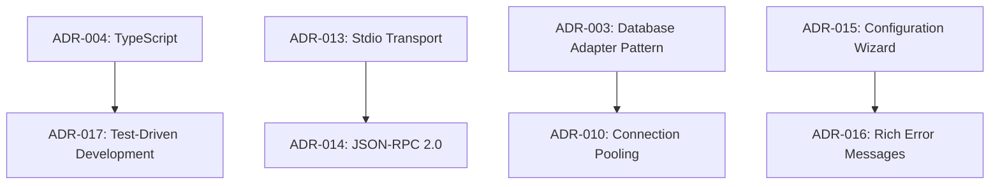

# Design Decisions

This document records important architectural and design decisions made during the development of the SQL MCP Server, along with the reasoning, alternatives considered, and trade-offs involved.

## 📋 Table of Contents

- [Architecture Decisions](#architecture-decisions)
- [Technology Choices](#technology-choices)
- [Security Decisions](#security-decisions)
- [Performance Decisions](#performance-decisions)
- [Protocol Decisions](#protocol-decisions)
- [User Experience Decisions](#user-experience-decisions)
- [Development Process Decisions](#development-process-decisions)

---

## 🏗️ Architecture Decisions

### ADR-001: Layered Architecture with Dependency Injection

**Status**: Accepted  
**Date**: 2024-11-15  
**Deciders**: Core Team

#### Context
The system needs to handle multiple concerns: protocol communication, database connectivity, security validation, and schema management. We need a maintainable, testable architecture.

#### Decision
Implement a layered architecture with clear separation of concerns:
- **Protocol Layer** (SQLMCPServer): Handles MCP communication
- **Service Layer** (ConnectionManager, SecurityManager, SchemaManager): Business logic
- **Data Layer** (Database adapters): Database-specific implementations

#### Consequences
**Positive:**
- Clear separation of concerns
- High testability through dependency injection  
- Easy to extend with new database types
- Maintainable codebase

**Negative:**
- More complex initial setup
- Slight performance overhead from abstraction layers

#### Alternatives Considered
1. **Monolithic approach**: Single class handling all concerns
   - Rejected: Would be difficult to test and maintain
2. **Microservices**: Separate services for each concern
   - Rejected: Overkill for single-binary deployment requirement

---

### ADR-002: Event-Driven Component Communication

**Status**: Accepted  
**Date**: 2024-11-18  
**Deciders**: Core Team

#### Context
Components need to communicate state changes and events without tight coupling.

#### Decision
Use Node.js EventEmitter pattern for inter-component communication:
```typescript
// Components emit events for significant state changes
connectionManager.emit('connected', database);
securityManager.emit('query-blocked', database, reason);
```

#### Consequences
**Positive:**
- Loose coupling between components
- Easy to add logging and monitoring
- Natural audit trail through events
- Facilitates reactive patterns

**Negative:**
- Harder to track control flow in complex scenarios
- Potential for event handler memory leaks

#### Alternatives Considered
1. **Direct method calls**: Components call each other directly
   - Rejected: Creates tight coupling
2. **Message queue**: External message broker
   - Rejected: Adds deployment complexity

---

### ADR-003: Database Adapter Pattern

**Status**: Accepted  
**Date**: 2024-11-20  
**Deciders**: Core Team, Database Expert

#### Context
Need to support multiple database types (PostgreSQL, MySQL, SQLite, SQL Server) with different connection methods and query dialects.

#### Decision
Implement adapter pattern with:
- **Base adapter interface** defining common operations
- **Database-specific adapters** implementing vendor-specific logic
- **Factory pattern** for adapter creation based on configuration

```typescript
interface DatabaseAdapter {
  connect(config: DatabaseConfig): Promise<void>;
  executeQuery(query: string, params?: any[]): Promise<QueryResult>;
  getSchema(): Promise<DatabaseSchema>;
  disconnect(): Promise<void>;
}
```

#### Consequences
**Positive:**
- Easy to add new database types
- Database-specific optimizations possible
- Clear abstraction for testing
- Consistent API across database types

**Negative:**
- More code to maintain
- Potential for lowest-common-denominator feature set

#### Alternatives Considered
1. **Single universal adapter**: One adapter for all databases
   - Rejected: Would miss database-specific features
2. **Query builder library**: Use existing ORM/query builder
   - Rejected: Too heavy for our use case, limits SQL flexibility

---

## 💻 Technology Choices

### ADR-004: TypeScript as Primary Language

**Status**: Accepted  
**Date**: 2024-11-10  
**Deciders**: Core Team

#### Context
Need to choose implementation language that balances developer productivity, type safety, and ecosystem support.

#### Decision
Use TypeScript for all implementation code with strict type checking enabled.

#### Consequences
**Positive:**
- Compile-time type checking reduces runtime errors
- Excellent IDE support with IntelliSense
- Large ecosystem of typed libraries
- Easy to refactor with confidence
- Self-documenting code through interfaces

**Negative:**
- Build step required (transpilation)
- Learning curve for team members new to TypeScript
- Some library compatibility issues

#### Alternatives Considered
1. **JavaScript**: Simpler deployment, no build step
   - Rejected: Lack of type safety for complex system
2. **Python**: Great database library ecosystem
   - Rejected: Performance concerns, deployment complexity
3. **Go**: Excellent performance, single binary
   - Rejected: Team expertise in Node.js ecosystem

---

### ADR-005: Node.js Runtime Platform

**Status**: Accepted  
**Date**: 2024-11-10  
**Deciders**: Core Team

#### Context
Need runtime platform that supports MCP protocol requirements (stdio-based JSON-RPC) and has good database driver ecosystem.

#### Decision
Use Node.js as runtime platform with focus on LTS versions.

#### Consequences
**Positive:**
- Excellent JSON-RPC and stdio handling
- Rich ecosystem of database drivers
- Good async I/O performance
- Team expertise
- Cross-platform compatibility
- Easy deployment with pkg or similar tools

**Negative:**
- Single-threaded event loop limitations
- Memory usage higher than compiled languages
- Dependency management complexity

#### Alternatives Considered
1. **Python**: Great for data processing
   - Rejected: Performance concerns for high-throughput scenarios
2. **Rust**: Excellent performance and safety
   - Rejected: Team expertise and development speed concerns
3. **Java**: Mature ecosystem
   - Rejected: Heavy runtime, complex deployment

---

### ADR-006: INI Configuration Format

**Status**: Accepted  
**Date**: 2024-11-25  
**Deciders**: Core Team, UX Designer

#### Context
Need configuration format that is simple for users to edit while supporting complex nested configuration.

#### Decision
Use INI format with sections for different databases and global settings:

```ini
[database.production]
type=postgresql
host=db.example.com
select_only=true

[security] 
max_joins=10
max_complexity_score=100
```

#### Consequences
**Positive:**
- Simple syntax familiar to most users
- Comments supported for documentation
- Section-based organization
- No complex nesting syntax to learn
- Wide tooling support

**Negative:**
- Limited nesting capabilities
- No arrays or complex data structures
- Manual parsing required for some data types

#### Alternatives Considered
1. **JSON**: Structured and widely supported
   - Rejected: No comments, error-prone for manual editing
2. **YAML**: More readable than JSON, supports comments
   - Rejected: Indentation-sensitive, more complex syntax
3. **TOML**: More features than INI
   - Rejected: Less familiar to users

---

## 🔒 Security Decisions

### ADR-007: SELECT-Only Mode as Default

**Status**: Accepted  
**Date**: 2024-11-12  
**Deciders**: Security Team, Core Team

#### Context
Balance between functionality and security for production database access.

#### Decision
Make SELECT-only mode the default for all database configurations, requiring explicit opt-in for write access.

```typescript
// Default configuration
const defaultConfig: DatabaseConfig = {
  select_only: true, // Default to safe mode
  // ... other settings
};
```

#### Consequences
**Positive:**
- Production-safe by default
- Prevents accidental data modification
- Reduces impact of potential security vulnerabilities
- Clear intention required for write access

**Negative:**
- Extra configuration step for write access use cases
- May confuse users expecting full database access

#### Alternatives Considered
1. **Full access by default**: More permissive default
   - Rejected: Too risky for production environments
2. **Runtime permission prompts**: Ask user at execution time
   - Rejected: Breaks automation and server-side operation

---

### ADR-008: Query Complexity Analysis

**Status**: Accepted  
**Date**: 2024-11-14  
**Deciders**: Security Team, Database Expert

#### Context
Need to prevent resource-intensive queries that could impact database performance or availability.

#### Decision
Implement static query complexity analysis based on:
- Number of JOINs, subqueries, UNIONs
- Presence of aggregate functions
- Query length and nesting depth
- Scoring system with configurable limits

```typescript
interface ComplexityAnalysis {
  score: number;
  riskLevel: 'LOW' | 'MEDIUM' | 'HIGH' | 'CRITICAL';
  factors: ComplexityFactor[];
  recommendations: string[];
}
```

#### Consequences
**Positive:**
- Prevents runaway queries
- Configurable limits for different environments
- Educational feedback for users
- No runtime query performance impact

**Negative:**
- May block legitimate complex queries
- Static analysis limitations
- Maintenance overhead for complexity rules

#### Alternatives Considered
1. **Runtime query timeouts only**: Simpler approach
   - Rejected: Doesn't prevent resource consumption
2. **Database query plans**: Use EXPLAIN for analysis
   - Rejected: Database-specific and requires query execution
3. **No complexity analysis**: Trust user judgment
   - Rejected: Too risky for production environments

---

### ADR-009: SSH Tunnel Security Model

**Status**: Accepted  
**Date**: 2024-11-16  
**Deciders**: Security Team, Infrastructure Team

#### Context
Many production databases are not directly accessible and require SSH tunnels for secure access.

#### Decision
Implement SSH tunnel support with:
- Key-based authentication preferred over passwords
- Automatic tunnel lifecycle management
- Tunnel reuse for multiple queries
- Support for bastion host patterns

```typescript
interface SSHConfig {
  host: string;
  username: string;
  privateKey?: string;  // Preferred
  password?: string;    // Fallback
  passphrase?: string;  // For encrypted keys
}
```

#### Consequences
**Positive:**
- Secure access to production databases
- Industry-standard security practices
- Flexible authentication methods
- No permanent network configuration changes

**Negative:**
- Additional configuration complexity
- SSH key management requirements
- Potential connection stability issues
- Debug complexity for connection issues

#### Alternatives Considered
1. **VPN-only access**: Require VPN for database access
   - Rejected: Not always available, deployment complexity
2. **Database SSL/TLS only**: Use database native encryption
   - Rejected: Doesn't solve network accessibility
3. **No tunnel support**: Require direct network access
   - Rejected: Not compatible with secure production environments

---

## ⚡ Performance Decisions

### ADR-010: Connection Pooling Strategy

**Status**: Accepted  
**Date**: 2024-11-22  
**Deciders**: Performance Team, Core Team

#### Context
Database connections are expensive to create and should be reused across multiple queries for efficiency.

#### Decision
Implement per-database connection pooling with:
- Lazy connection creation (on first query)
- Connection reuse across tool calls
- Automatic connection health monitoring
- Configurable connection timeouts

```typescript
class ConnectionManager {
  private connections = new Map<string, DatabaseConnection>();
  
  async getConnection(database: string): Promise<DatabaseConnection> {
    if (!this.connections.has(database)) {
      const connection = await this.createConnection(database);
      this.connections.set(database, connection);
    }
    return this.connections.get(database)!;
  }
}
```

#### Consequences
**Positive:**
- Significant performance improvement for multiple queries
- Reduced database server connection overhead
- Better resource utilization
- Automatic cleanup on server shutdown

**Negative:**
- Memory usage for idle connections
- Connection state management complexity
- Potential for connection leaks

#### Alternatives Considered
1. **New connection per query**: Simpler but slower
   - Rejected: Poor performance for interactive use
2. **External connection pooler**: Use pgbouncer, etc.
   - Rejected: Additional deployment complexity
3. **Shared connection pool**: Pool across all databases
   - Rejected: Security isolation concerns

---

### ADR-011: Schema Caching Strategy

**Status**: Accepted  
**Date**: 2024-11-24  
**Deciders**: Performance Team, Database Expert

#### Context
Database schema introspection is expensive but schema changes are infrequent. Need to balance freshness with performance.

#### Decision
Implement in-memory schema caching with:
- Lazy schema capture on first connection
- Manual refresh capability via tool
- Schema context generation for AI queries
- No automatic expiration (manual refresh required)

```typescript
class SchemaManager {
  private schemas = new Map<string, DatabaseSchema>();
  
  async captureSchema(database: string): Promise<DatabaseSchema> {
    const schema = await this.introspectDatabase(database);
    this.schemas.set(database, schema);
    return schema;
  }
}
```

#### Consequences
**Positive:**
- Near-instant schema access after initial capture
- Rich context for AI-generated queries
- Reduced database load from repeated schema queries
- Memory-efficient storage

**Negative:**
- Schema may become stale after database changes
- Manual refresh burden on users
- Memory usage grows with database count
- Complex schema change detection

#### Alternatives Considered
1. **Real-time schema queries**: Query schema for each request
   - Rejected: Poor performance, database load
2. **TTL-based expiration**: Automatic cache invalidation
   - Rejected: May miss rapid schema changes or cache unnecessarily
3. **File-based caching**: Persist schema to disk
   - Rejected: File management complexity, slower access

---

### ADR-012: Result Set Limiting

**Status**: Accepted  
**Date**: 2024-11-26  
**Deciders**: Performance Team, UX Designer

#### Context
Query results can be very large, causing memory issues and poor user experience in AI chat interface.

#### Decision
Implement configurable result set limits with:
- Default limit of 1,000 rows
- Truncation indicators in responses
- Configurable per-database or globally
- Streaming for large results (future enhancement)

```typescript
interface QueryResult {
  rows: Record<string, any>[];
  rowCount: number;
  truncated: boolean;  // Indicates if results were limited
}
```

#### Consequences
**Positive:**
- Predictable memory usage
- Better chat interface experience
- Prevents server resource exhaustion
- Clear indication of truncation to users

**Negative:**
- May hide important data in large result sets
- Users may not realize results are truncated
- Additional configuration complexity

#### Alternatives Considered
1. **No limits**: Return all results
   - Rejected: Memory and performance issues
2. **Pagination**: Return results in pages
   - Rejected: Complex for AI chat interface
3. **Streaming**: Stream results as they arrive
   - Deferred: Requires protocol enhancements

---

## 🔌 Protocol Decisions

### ADR-013: Stdio-based MCP Transport

**Status**: Accepted  
**Date**: 2024-11-08  
**Deciders**: Protocol Team, Claude Integration Team

#### Context
MCP protocol supports multiple transports. Need to choose one that works well with Claude Desktop integration.

#### Decision
Use stdio (standard input/output) transport as primary and only supported method.

#### Consequences
**Positive:**
- Native support in Claude Desktop
- Simple deployment (no network configuration)
- Works across all platforms
- Natural process isolation
- No port conflicts or firewall issues

**Negative:**
- Limited to single client connection
- Harder to debug (can't use console logging)
- No connection persistence across client restarts
- Cannot support multiple concurrent clients

#### Alternatives Considered
1. **HTTP/WebSocket transport**: More flexible networking
   - Rejected: More complex deployment, firewall issues
2. **TCP socket transport**: Better performance
   - Rejected: Network configuration complexity
3. **Named pipes**: Platform-specific IPC
   - Rejected: Cross-platform compatibility issues

---

### ADR-014: JSON-RPC 2.0 Message Format

**Status**: Accepted  
**Date**: 2024-11-08  
**Deciders**: Protocol Team

#### Context
MCP protocol is based on JSON-RPC 2.0. Need to decide on strict compliance vs. extensions.

#### Decision
Implement strict JSON-RPC 2.0 compliance with no custom extensions.

#### Consequences
**Positive:**
- Standard protocol compliance
- Interoperability with other MCP clients
- Clear protocol semantics
- Good tooling support

**Negative:**
- Limited by JSON-RPC capabilities
- No custom protocol optimizations
- Verbose for simple operations

#### Alternatives Considered
1. **Custom protocol**: Design domain-specific protocol
   - Rejected: Loss of MCP ecosystem compatibility
2. **JSON-RPC with extensions**: Add custom fields
   - Rejected: May break compatibility with other clients

---

## 👤 User Experience Decisions

### ADR-015: Interactive Configuration Wizard

**Status**: Accepted  
**Date**: 2024-11-28  
**Deciders**: UX Team, Core Team

#### Context
Database configuration can be complex with many required fields and security considerations.

#### Decision
Implement interactive CLI wizard that guides users through:
- Database type selection
- Connection parameter entry
- Security configuration
- SSH tunnel setup
- Configuration validation and testing

```bash
sql-mcp-setup
? Select database type: PostgreSQL
? Database host: db.example.com
? Enable SELECT-only mode? Yes (recommended)
? Configure SSH tunnel? Yes
```

#### Consequences
**Positive:**
- Lower barrier to entry for new users
- Reduces configuration errors
- Provides security best practices guidance
- Validates configuration before saving

**Negative:**
- More complex initial implementation
- Wizard may not cover all advanced scenarios
- Command-line interface may not suit all users

#### Alternatives Considered
1. **Manual configuration only**: Users edit INI files directly
   - Rejected: Too error-prone for complex configurations
2. **Web-based configuration UI**: Browser-based setup
   - Rejected: Additional deployment complexity, security concerns
3. **Configuration templates**: Pre-built examples
   - Rejected: Still requires manual editing, less guidance

---

### ADR-016: Rich Error Messages with Troubleshooting

**Status**: Accepted  
**Date**: 2024-11-30  
**Deciders**: UX Team, Support Team

#### Context
Database connectivity and query errors can be cryptic and hard to resolve for non-expert users.

#### Decision
Implement rich error messages that include:
- Clear error description
- Probable causes
- Step-by-step troubleshooting guidance
- Links to relevant documentation

```typescript
// Example error response
{
  error: "Connection failed to database 'production'",
  troubleshooting: [
    "• Verify database host and port are correct",
    "• Check network connectivity", 
    "• Ensure database is running",
    "• Validate credentials"
  ],
  documentation: "docs/troubleshooting-guide.md#connection-errors"
}
```

#### Consequences
**Positive:**
- Reduced support burden
- Better user experience for non-experts
- Faster problem resolution
- Educational value for users

**Negative:**
- Larger response messages
- More complex error handling logic
- Maintenance overhead for troubleshooting content

#### Alternatives Considered
1. **Simple error messages**: Just error codes and basic messages
   - Rejected: Poor user experience, high support load
2. **External error database**: Look up detailed errors separately
   - Rejected: Adds complexity, requires network access

---

## 🛠️ Development Process Decisions

### ADR-017: Test-Driven Development Approach

**Status**: Accepted  
**Date**: 2024-11-05  
**Deciders**: Core Team, Quality Team

#### Context
System has complex error conditions, security requirements, and multiple database integrations that need thorough testing.

#### Decision
Adopt test-driven development with:
- Unit tests for all core logic
- Integration tests for database operations
- Protocol compliance tests for MCP implementation
- Security tests for validation logic
- Performance tests for scalability validation

#### Consequences
**Positive:**
- High confidence in system reliability
- Easier refactoring and maintenance
- Documentation through tests
- Faster development cycle with automated validation

**Negative:**
- More upfront development time
- Test maintenance overhead
- Learning curve for team members

#### Alternatives Considered
1. **Manual testing only**: Test by hand during development
   - Rejected: Not sufficient for complex system with multiple integrations
2. **Integration tests only**: Focus on end-to-end scenarios
   - Rejected: Harder to debug failures, slower feedback loop
3. **Unit tests only**: Focus on individual component testing
   - Rejected: Doesn't catch integration issues

---

### ADR-018: Semantic Versioning and Release Strategy

**Status**: Accepted  
**Date**: 2024-12-01  
**Deciders**: Core Team, DevOps Team

#### Context
Need clear versioning strategy for backwards compatibility and user expectations.

#### Decision
Adopt semantic versioning (SemVer) with:
- **Major**: Breaking changes to MCP protocol or configuration format
- **Minor**: New features, new database support, new tools
- **Patch**: Bug fixes, security updates, documentation improvements

```typescript
// Version in package.json and server info
export const SERVER_VERSION = '2.0.0';
```

#### Consequences
**Positive:**
- Clear compatibility expectations for users
- Standard versioning convention
- Automated tooling support
- Easy to communicate impact of updates

**Negative:**
- Requires discipline in change classification
- May hold back breaking improvements
- Version number inflation with frequent releases

#### Alternatives Considered
1. **CalVer (Calendar Versioning)**: Version based on release date
   - Rejected: Less clear about compatibility impact
2. **Custom versioning**: Project-specific scheme
   - Rejected: Confusing for users familiar with SemVer
3. **No versioning**: Always latest version
   - Rejected: No way to manage compatibility

---

### ADR-019: Monorepo vs Multi-repo Structure

**Status**: Accepted  
**Date**: 2024-11-03  
**Deciders**: Core Team, DevOps Team

#### Context
Decide how to organize codebase, documentation, and related tools.

#### Decision
Use monorepo structure with all components in single repository:
- Server implementation in `/src`
- Documentation in `/docs` 
- Tests in `/tests`
- Examples in `/examples`
- Build scripts in `/scripts`

#### Consequences
**Positive:**
- Simplified dependency management
- Easier to maintain consistency across components
- Single issue tracker and CI/CD pipeline
- Easier for contributors to understand full system

**Negative:**
- Larger repository size
- All components released together
- Potential for merge conflicts in large teams

#### Alternatives Considered
1. **Multi-repo**: Separate repositories for server, docs, examples
   - Rejected: Coordination overhead, version management complexity
2. **Hybrid**: Server separate, documentation and tools together
   - Rejected: Partial benefits of either approach

---

### ADR-020: Documentation-Driven Development

**Status**: Accepted  
**Date**: 2024-12-02  
**Deciders**: Core Team, Documentation Team

#### Context
Complex system with multiple user personas (developers, DBAs, data analysts) requires comprehensive documentation.

#### Decision
Adopt documentation-driven development approach:
- Write documentation before implementation
- API documentation defines interfaces
- User guides drive feature requirements
- Architecture docs guide implementation decisions

#### Consequences
**Positive:**
- Better user experience through design focus
- Clearer requirements and specifications
- Easier onboarding for new team members
- Forces thinking through user workflows

**Negative:**
- More upfront work before coding
- Documentation maintenance overhead
- May slow initial development

#### Alternatives Considered
1. **Code-first approach**: Write code, document later
   - Rejected: Often results in poor documentation coverage
2. **Minimal documentation**: Only basic API docs
   - Rejected: Insufficient for complex system with multiple user types

---

## 📊 Decision Impact Assessment

### High-Impact Decisions
These decisions had the most significant impact on system design:

1. **ADR-003 (Database Adapter Pattern)**: Enabled multi-database support
2. **ADR-007 (SELECT-Only Default)**: Defined security-first approach
3. **ADR-013 (Stdio Transport)**: Determined deployment and integration model
4. **ADR-004 (TypeScript)**: Set development velocity and quality standards

### Decision Dependencies
Some decisions built on or constrained others:



### Future Decision Points
Areas that may require future architectural decisions:

1. **Horizontal Scaling**: Multi-process or clustering support
2. **Alternative Transports**: WebSocket or HTTP support
3. **Plugin Architecture**: Third-party extensions
4. **Caching Strategy**: Distributed caching for large deployments
5. **Monitoring Integration**: APM and observability platform integration

---

## 🔄 Decision Review Process

### Regular Review Schedule
- **Quarterly**: Review performance and security decisions
- **Annually**: Review technology choices and architecture decisions
- **Ad-hoc**: Review when facing new requirements or constraints

### Review Criteria
- Is the decision still valid given current requirements?
- Have new technologies or approaches emerged that address the original concerns better?
- What has been the actual impact of the decision in practice?
- Are there simpler alternatives that achieve the same goals?

### Decision Amendment Process
1. **Propose Change**: Document new requirements or constraints
2. **Impact Assessment**: Analyze backwards compatibility and migration effort
3. **Alternative Analysis**: Consider multiple approaches
4. **Team Review**: Get input from affected stakeholders
5. **Decision**: Update ADR with new status (superseded, amended, etc.)

This living document of design decisions provides crucial context for understanding the SQL MCP Server architecture and guides future development decisions.