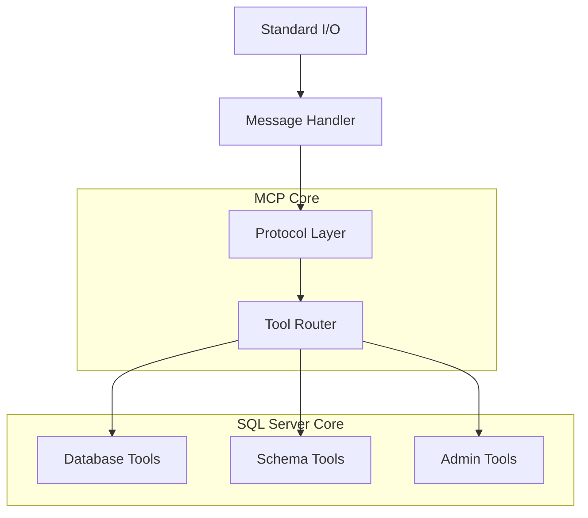

# MCP Protocol Implementation

This document details how the SQL MCP Server implements the Model Context Protocol (MCP) for seamless integration with Claude Desktop and other MCP-compatible clients.

## 📋 Table of Contents

- [MCP Protocol Overview](#mcp-protocol-overview)
- [Protocol Implementation](#protocol-implementation)
- [Message Handling](#message-handling)
- [Tool System](#tool-system)
- [Error Handling](#error-handling)
- [Performance Optimizations](#performance-optimizations)
- [Security Considerations](#security-considerations)
- [Testing & Validation](#testing--validation)

---

## 🔌 MCP Protocol Overview

### What is MCP?
The Model Context Protocol (MCP) is a standardized protocol that enables AI assistants like Claude to securely interact with external systems and data sources. It provides:

- **Structured Communication**: JSON-RPC 2.0 based messaging
- **Tool Discovery**: Dynamic tool registration and capability advertisement
- **Security**: Built-in validation and sandboxing
- **Extensibility**: Plugin architecture for custom integrations

### Protocol Specification
- **Version**: 2025-06-18
- **Transport**: stdio (standard input/output)
- **Message Format**: JSON-RPC 2.0
- **Encoding**: UTF-8

---

## 🏗️ Protocol Implementation

### Server Architecture
The SQL MCP Server implements the complete MCP specification:



### Message Flow
1. **Client Connection**: Claude Desktop connects via stdio
2. **Initialization Handshake**: Server capabilities negotiation
3. **Tool Discovery**: Client requests available tools
4. **Tool Execution**: Client calls tools with parameters
5. **Response Delivery**: Server returns structured results

### Implementation Classes

#### MCPServer (SQLMCPServer)
Main server class handling protocol implementation:

```typescript
export class SQLMCPServer extends EventEmitter {
  // Core protocol methods
  private async handleInitialize(request: MCPRequest): Promise<MCPResponse>;
  private async handleToolsList(request: MCPRequest): Promise<MCPResponse>;
  private async handleToolCall(request: MCPRequest): Promise<MCPResponse>;
  
  // Message processing
  private async handleMessage(messageStr: string): Promise<void>;
  private async handleRequest(request: MCPRequest): Promise<MCPResponse | null>;
  
  // Protocol utilities
  private sendMessage(message: MCPMessage): void;
  private sendErrorResponse(id: string | number | null, code: number, message: string): void;
}
```

---

## 📨 Message Handling

### Supported Methods
The server implements all required MCP methods:

| Method | Purpose | Implementation |
|--------|---------|----------------|
| `initialize` | Server capability negotiation | Returns server info and capabilities |
| `tools/list` | Tool discovery | Returns all available SQL tools |
| `tools/call` | Tool execution | Routes to specific tool handlers |
| `notifications/initialized` | Client ready signal | Acknowledges client initialization |

### Message Processing Pipeline

```typescript
// 1. Input Processing
process.stdin.on('data', (chunk: string) => {
  buffer += chunk;
  const lines = buffer.split('\n');
  buffer = lines.pop() || '';

  for (const line of lines) {
    if (line.trim()) {
      this.handleMessage(line.trim());
    }
  }
});

// 2. Message Parsing & Validation
private async handleMessage(messageStr: string): Promise<void> {
  try {
    const message: MCPMessage = JSON.parse(messageStr);
    
    if (isMCPRequest(message)) {
      const response = await this.handleRequest(message);
      if (response) {
        this.sendMessage(response);
      }
    }
  } catch (error) {
    this.sendErrorResponse(null, -32700, 'Parse error');
  }
}

// 3. Request Routing
private async handleRequest(request: MCPRequest): Promise<MCPResponse | null> {
  switch (request.method) {
    case 'initialize': return await this.handleInitialize(request);
    case 'tools/list': return await this.handleToolsList(request);
    case 'tools/call': return await this.handleToolCall(request);
    case 'notifications/initialized': return null; // No response needed
    default: return this.createErrorResponse(request.id, -32601, 'Method not found');
  }
}
```

### Initialize Method Implementation
```typescript
private async handleInitialize(request: MCPRequest): Promise<MCPResponse> {
  const result: MCPInitializeResult = {
    protocolVersion: MCP_PROTOCOL_VERSION,
    capabilities: {
      tools: {}, // Tool-related capabilities
      logging: {} // Logging capabilities
    },
    serverInfo: {
      name: SERVER_NAME,
      version: SERVER_VERSION
    }
  };

  return {
    jsonrpc: '2.0',
    id: request.id,
    result
  };
}
```

### Tools List Implementation
```typescript
private async handleToolsList(request: MCPRequest): Promise<MCPResponse> {
  const tools: MCPTool[] = [
    {
      name: "sql_query",
      description: "Execute a single SQL query on a configured database",
      inputSchema: {
        type: "object",
        properties: {
          database: { type: "string", description: "Database name" },
          query: { type: "string", description: "SQL query to execute" },
          params: { type: "array", items: { type: "string" }, description: "Query parameters" }
        },
        required: ["database", "query"],
        additionalProperties: false
      }
    },
    // ... other tools
  ];

  return {
    jsonrpc: '2.0',
    id: request.id,
    result: { tools }
  };
}
```

---

## 🛠️ Tool System

### Tool Registration Architecture
Tools are statically registered at server startup:

```typescript
interface ToolDefinition {
  name: string;
  description: string;
  inputSchema: JSONSchema;
  handler: ToolHandler;
  validator?: InputValidator;
}

type ToolHandler = (args: any) => Promise<MCPToolResponse>;
type InputValidator = (args: any) => ValidationResult;
```

### Tool Execution Pipeline
1. **Input Validation**: Validate arguments against JSON schema
2. **Security Check**: Apply security policies and restrictions
3. **Handler Execution**: Execute tool-specific logic
4. **Response Formatting**: Format results for MCP protocol
5. **Error Handling**: Convert errors to MCP error format

### Tool Implementation Example
```typescript
// sql_query tool implementation
private async handleSqlQuery(args: SQLQueryArgs): Promise<MCPToolResponse> {
  const { database, query, params = [] } = args;
  
  try {
    // 1. Validate arguments
    if (!isSQLQueryArgs(args)) {
      throw new Error("Invalid arguments for sql_query");
    }
    
    // 2. Security validation
    const dbConfig = this.getDatabaseConfig(database);
    if (dbConfig?.select_only) {
      const validation = this.securityManager.validateSelectOnlyQuery(query, dbConfig.type);
      if (!validation.allowed) {
        throw new SecurityViolationError(validation.reason!);
      }
    }
    
    // 3. Execute query
    const result = await this.connectionManager.executeQuery(database, query, params);
    
    // 4. Format response
    const responseText = this.formatQueryResponse(result, database, dbConfig);
    
    return {
      content: [{ type: "text", text: responseText }],
      _meta: { progressToken: null }
    };
    
  } catch (error) {
    return {
      content: [{ 
        type: "text", 
        text: `❌ Error: ${error.message}` 
      }],
      isError: true,
      _meta: { progressToken: null }
    };
  }
}
```

### Dynamic Tool Discovery
Tools can be discovered dynamically based on configuration:

```typescript
private generateToolList(): MCPTool[] {
  const tools: MCPTool[] = [];
  
  // Core tools (always available)
  tools.push(...this.getCoreTools());
  
  // Database-specific tools
  if (this.hasConfiguredDatabases()) {
    tools.push(...this.getDatabaseTools());
  }
  
  // Admin tools (if enabled)
  if (this.config?.extension?.enable_admin_tools) {
    tools.push(...this.getAdminTools());
  }
  
  return tools;
}
```

---

## ❌ Error Handling

### MCP Error Format
All errors follow JSON-RPC 2.0 error format:

```typescript
interface MCPError {
  code: number;
  message: string;
  data?: any;
}

// Standard error codes
const ERROR_CODES = {
  PARSE_ERROR: -32700,
  INVALID_REQUEST: -32600,
  METHOD_NOT_FOUND: -32601,
  INVALID_PARAMS: -32602,
  INTERNAL_ERROR: -32603
} as const;
```

### Error Response Generation
```typescript
private createErrorResponse(
  id: string | number | null, 
  code: number, 
  message: string,
  data?: any
): MCPResponse {
  return {
    jsonrpc: '2.0',
    id,
    error: { code, message, data }
  };
}
```

### Tool Error Handling
Tool errors are converted to user-friendly responses:

```typescript
private formatToolError(error: Error, toolName: string): MCPToolResponse {
  let errorMessage = `❌ Error in ${toolName}: ${error.message}`;
  
  // Add context-specific troubleshooting
  if (error instanceof SecurityViolationError) {
    errorMessage += '\n\n🛡️ **Security Information:**\n';
    errorMessage += 'This database is configured with SELECT-only mode for safety.';
  } else if (error instanceof ConnectionError) {
    errorMessage += '\n\n🔧 **Connection Troubleshooting:**\n';
    errorMessage += '- Verify database configuration\n';
    errorMessage += '- Check network connectivity\n';
    errorMessage += '- Ensure database is running';
  }
  
  return {
    content: [{ type: "text", text: errorMessage }],
    isError: true,
    _meta: { progressToken: null }
  };
}
```

---

## ⚡ Performance Optimizations

### Message Buffering
Efficient handling of streaming stdio input:

```typescript
private setupStdioHandling(): void {
  let buffer = '';
  
  process.stdin.on('data', (chunk: string) => {
    buffer += chunk;
    
    // Process complete messages
    const lines = buffer.split('\n');
    buffer = lines.pop() || ''; // Keep incomplete line
    
    for (const line of lines) {
      if (line.trim()) {
        // Process in next tick to prevent blocking
        setImmediate(() => this.handleMessage(line.trim()));
      }
    }
  });
}
```

### Response Streaming
Large responses can be streamed using progress tokens:

```typescript
private async handleLargeDataSet(
  database: string, 
  query: string
): Promise<MCPToolResponse> {
  const progressToken = generateProgressToken();
  
  // Start async processing
  this.processLargeQuery(database, query, progressToken);
  
  return {
    content: [{ 
      type: "text", 
      text: "🔄 Processing large query..." 
    }],
    _meta: { progressToken }
  };
}
```

### Connection Pooling
Reuse database connections across tool calls:

```typescript
private connectionPool = new Map<string, DatabaseConnection>();

private async getConnection(database: string): Promise<DatabaseConnection> {
  if (!this.connectionPool.has(database)) {
    const connection = await this.createConnection(database);
    this.connectionPool.set(database, connection);
  }
  
  return this.connectionPool.get(database)!;
}
```

---

## 🔒 Security Considerations

### Input Validation
All tool inputs are validated against JSON schemas:

```typescript
private validateToolInput(toolName: string, args: any): ValidationResult {
  const tool = this.tools.get(toolName);
  if (!tool) {
    return { valid: false, error: 'Unknown tool' };
  }
  
  const validator = ajv.compile(tool.inputSchema);
  const valid = validator(args);
  
  if (!valid) {
    return { 
      valid: false, 
      error: 'Invalid input',
      details: validator.errors 
    };
  }
  
  return { valid: true };
}
```

### Output Sanitization
All outputs are sanitized to prevent information leakage:

```typescript
private sanitizeOutput(result: QueryResult, config: DatabaseConfig): QueryResult {
  // Limit result size
  if (result.rows.length > this.config.extension?.max_rows || 1000) {
    result.rows = result.rows.slice(0, this.config.extension?.max_rows || 1000);
    result.truncated = true;
  }
  
  // Remove sensitive fields if configured
  if (config.hide_sensitive_data) {
    result.rows = result.rows.map(row => this.removeSensitiveFields(row));
  }
  
  return result;
}
```

### Protocol Security
- **No arbitrary code execution**: Only predefined tools allowed
- **Sandboxed operations**: Database operations isolated by configuration
- **Input validation**: All inputs validated against strict schemas
- **Output limits**: Response size limits prevent resource exhaustion

---

## 🧪 Testing & Validation

### Protocol Compliance Testing
```typescript
describe('MCP Protocol Compliance', () => {
  it('should handle initialize request correctly', async () => {
    const request: MCPRequest = {
      jsonrpc: '2.0',
      id: 1,
      method: 'initialize',
      params: {
        protocolVersion: '2025-06-18',
        capabilities: {},
        clientInfo: { name: 'test-client', version: '1.0.0' }
      }
    };
    
    const response = await server.handleRequest(request);
    
    expect(response).toBeDefined();
    expect(response?.result).toHaveProperty('protocolVersion');
    expect(response?.result).toHaveProperty('capabilities');
    expect(response?.result).toHaveProperty('serverInfo');
  });
  
  it('should return valid tools list', async () => {
    const request: MCPRequest = {
      jsonrpc: '2.0',
      id: 2,
      method: 'tools/list'
    };
    
    const response = await server.handleRequest(request);
    
    expect(response?.result).toHaveProperty('tools');
    expect(Array.isArray(response?.result.tools)).toBe(true);
    
    // Validate each tool has required fields
    response?.result.tools.forEach((tool: MCPTool) => {
      expect(tool).toHaveProperty('name');
      expect(tool).toHaveProperty('description');
      expect(tool).toHaveProperty('inputSchema');
    });
  });
});
```

### Tool Integration Testing
```typescript
describe('Tool Integration', () => {
  it('should execute sql_query tool successfully', async () => {
    const request: MCPToolCallRequest = {
      jsonrpc: '2.0',
      id: 3,
      method: 'tools/call',
      params: {
        name: 'sql_query',
        arguments: {
          database: 'test',
          query: 'SELECT 1 as test_value'
        }
      }
    };
    
    const response = await server.handleRequest(request);
    
    expect(response?.result).toHaveProperty('content');
    expect(response?.result.isError).toBeFalsy();
  });
});
```

### Error Handling Testing
```typescript
describe('Error Handling', () => {
  it('should handle invalid JSON gracefully', async () => {
    const invalidJson = '{ invalid json }';
    
    // Mock stdout to capture error response
    const mockWrite = jest.spyOn(process.stdout, 'write').mockImplementation();
    
    await server.handleMessage(invalidJson);
    
    expect(mockWrite).toHaveBeenCalledWith(
      expect.stringContaining('"code":-32700')
    );
    
    mockWrite.mockRestore();
  });
  
  it('should handle unknown methods', async () => {
    const request: MCPRequest = {
      jsonrpc: '2.0',
      id: 4,
      method: 'unknown/method'
    };
    
    const response = await server.handleRequest(request);
    
    expect(response?.error).toBeDefined();
    expect(response?.error?.code).toBe(-32601);
  });
});
```

### Message Format Validation
```typescript
const messageSchemas = {
  request: {
    type: 'object',
    properties: {
      jsonrpc: { const: '2.0' },
      id: { type: ['string', 'number', 'null'] },
      method: { type: 'string' },
      params: { type: 'object' }
    },
    required: ['jsonrpc', 'method'],
    additionalProperties: false
  },
  
  response: {
    type: 'object',
    properties: {
      jsonrpc: { const: '2.0' },
      id: { type: ['string', 'number', 'null'] },
      result: { type: 'object' },
      error: {
        type: 'object',
        properties: {
          code: { type: 'number' },
          message: { type: 'string' },
          data: { type: 'object' }
        },
        required: ['code', 'message']
      }
    },
    required: ['jsonrpc', 'id'],
    oneOf: [
      { required: ['result'] },
      { required: ['error'] }
    ]
  }
};
```

---

## 📚 Best Practices

### Protocol Implementation
1. **Strict Compliance**: Follow MCP specification exactly
2. **Error Handling**: Provide meaningful error messages
3. **Performance**: Optimize for low latency and high throughput
4. **Security**: Validate all inputs and sanitize outputs
5. **Testing**: Comprehensive test coverage for all protocol aspects

### Tool Design
1. **Single Responsibility**: Each tool should have one clear purpose
2. **Clear Documentation**: Comprehensive descriptions and examples
3. **Input Validation**: Strict schema validation
4. **Error Recovery**: Graceful handling of edge cases
5. **Performance**: Efficient execution with reasonable timeouts

### Message Handling
1. **Async Processing**: Use async/await for all I/O operations
2. **Buffering**: Proper handling of streaming input
3. **Backpressure**: Handle high message volumes gracefully
4. **Memory Management**: Prevent memory leaks in long-running processes

This comprehensive MCP protocol implementation ensures reliable, secure, and performant integration with Claude Desktop and other MCP-compatible clients.