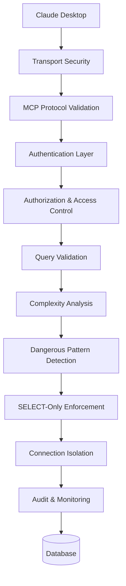
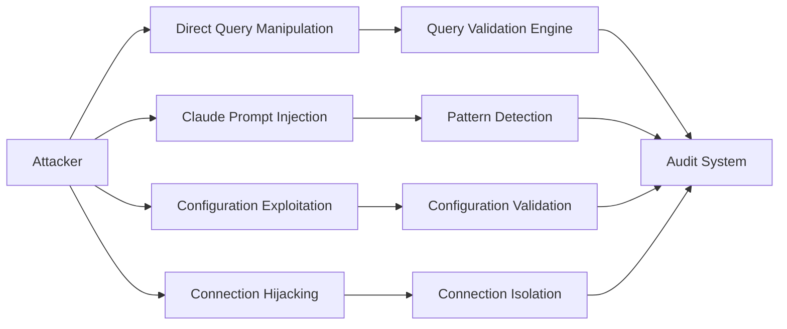
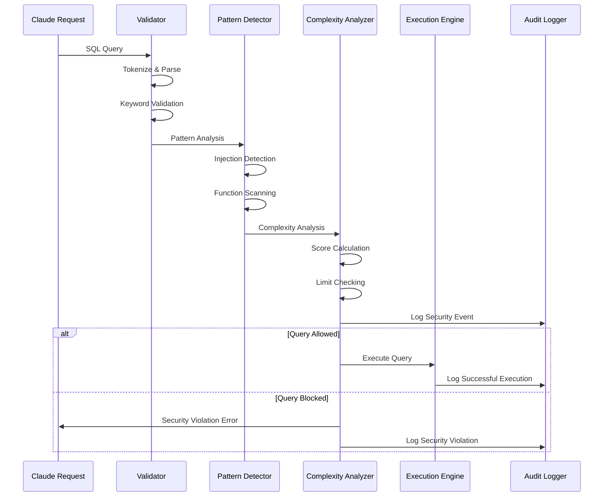

# Security Architecture

The SQL MCP Server implements a comprehensive, multi-layered security architecture designed to protect database assets while providing secure access to Claude Desktop. This document details the security model, threat analysis, and protective mechanisms.

## 🛡️ Security Philosophy

The security architecture follows the principle of **Defense in Depth**, implementing multiple security layers to protect against various threat vectors:

1. **Assume Breach**: Design for the scenario where one layer is compromised
2. **Least Privilege**: Minimum necessary access by default
3. **Fail Secure**: Default to blocking rather than allowing uncertain operations
4. **Audit Everything**: Comprehensive logging of all security-relevant events
5. **Defense in Depth**: Multiple independent security layers

## 🏛️ Security Layers



## 🔐 Core Security Components

### 1. Query Validation Engine

The `SecurityManager` class provides comprehensive SQL query validation through multiple stages:

#### SQL Tokenization & Parsing
```typescript
interface SQLToken {
  value: string;
  type: 'KEYWORD' | 'IDENTIFIER' | 'STRING' | 'OPERATOR' | 'UNKNOWN';
  position: number;
  normalized: string;
}
```

**Features:**
- **Lexical Analysis**: Breaks queries into tokens for detailed analysis
- **Keyword Classification**: Distinguishes between allowed and blocked keywords
- **Comment Stripping**: Removes SQL comments that could hide malicious code
- **Normalization**: Standardizes whitespace and casing for consistent analysis

#### Keyword-Based Filtering
```typescript
// Blocked keywords in SELECT-only mode
const blockedKeywords = [
  'INSERT', 'UPDATE', 'DELETE', 'DROP', 'CREATE', 'ALTER',
  'TRUNCATE', 'REPLACE', 'MERGE', 'UPSERT', 'GRANT', 'REVOKE',
  'EXEC', 'EXECUTE', 'CALL', 'SET', 'DECLARE', 'USE', 'LOAD',
  'IMPORT', 'EXPORT', 'BACKUP', 'RESTORE', 'ATTACH', 'DETACH'
];

// Allowed keywords in SELECT-only mode  
const allowedKeywords = [
  'SELECT', 'WITH', 'FROM', 'WHERE', 'JOIN', 'GROUP', 'BY',
  'HAVING', 'ORDER', 'LIMIT', 'UNION', 'CASE', 'WHEN', 'THEN',
  'COUNT', 'SUM', 'AVG', 'MIN', 'MAX', 'SHOW', 'EXPLAIN', 'DESCRIBE'
];
```

### 2. Query Complexity Analysis

Advanced complexity scoring prevents resource abuse and potential DoS attacks:

#### Complexity Metrics
```typescript
interface QueryComplexityAnalysis {
  score: number;                    // Overall complexity score
  factors: string[];                // Contributing complexity factors
  joinCount: number;                // Number of JOIN operations
  subqueryCount: number;           // Number of nested subqueries
  unionCount: number;              // Number of UNION operations
  groupByCount: number;            // Number of GROUP BY fields
  windowFuncCount: number;         // Number of window functions
  risk_level: 'LOW' | 'MEDIUM' | 'HIGH' | 'CRITICAL';
}
```

#### Complexity Scoring Algorithm
```typescript
calculateComplexityScore(query: string): number {
  let score = 0;
  
  // Weight different operations by resource impact
  score += joinCount * 5;          // JOINs are expensive
  score += subqueryCount * 10;     // Nested queries multiply complexity
  score += unionCount * 8;         // UNIONs require result merging
  score += groupByCount * 3;       // GROUP BY requires sorting/aggregation
  score += windowFuncCount * 7;    // Window functions are resource intensive
  score += Math.floor(query.length / 100); // Length factor
  
  return score;
}
```

#### Configurable Limits
```ini
[security]
max_joins=10                  # Maximum JOIN operations
max_subqueries=5              # Maximum nested subqueries  
max_unions=3                  # Maximum UNION operations
max_group_bys=5               # Maximum GROUP BY clauses
max_complexity_score=100      # Overall complexity threshold
max_query_length=10000        # Maximum query character length
```

### 3. Dangerous Pattern Detection

Multi-layered pattern recognition identifies potential security threats:

#### SQL Injection Detection
```typescript
const injectionPatterns = [
  /;\s*(DROP|DELETE|UPDATE|INSERT|EXEC|EXECUTE)/i,  // Command chaining
  /UNION\s+SELECT.*INTO/i,                          // Union-based injection
  /'\s*OR\s+'1'\s*=\s*'1/i,                       // Classic tautology
  /'\s*;\s*DROP\s+TABLE/i,                         // Table dropping
  /CONCAT\s*\(\s*CHAR\s*\(/i                       // Character encoding bypass
];
```

#### Function-Based Threats
```typescript
const dangerousFunctions = [
  'LOAD_FILE',        // File system access
  'INTO OUTFILE',     // File writing
  'INTO DUMPFILE',    // Binary file writing  
  'SYSTEM',           // System command execution
  'BENCHMARK',        // DoS via CPU consumption
  'SLEEP',            // DoS via time delays
  'WAITFOR DELAY'     // SQL Server time delays
];
```

#### Privilege Escalation Detection
```typescript
const privilegePatterns = [
  /CREATE\s+USER/i,     // User creation
  /GRANT\s+ALL/i,       // Permission grants
  /ALTER\s+USER/i,      // User modification
  /SET\s+PASSWORD/i     // Password changes
];
```

### 4. SELECT-Only Mode Enforcement

Provides read-only database access for production environments:

#### Access Control Matrix
| Operation Category | SELECT-Only Mode | Full Access Mode |
|-------------------|------------------|------------------|
| **Data Retrieval** | ✅ Allowed | ✅ Allowed |
| `SELECT`, `WITH` | ✅ | ✅ |
| **Schema Inspection** | ✅ Allowed | ✅ Allowed |
| `SHOW`, `EXPLAIN`, `DESCRIBE` | ✅ | ✅ |
| **Data Modification** | ❌ Blocked | ✅ Allowed |
| `INSERT`, `UPDATE`, `DELETE` | ❌ | ✅ |
| **Schema Changes** | ❌ Blocked | ✅ Allowed |
| `CREATE`, `ALTER`, `DROP` | ❌ | ✅ |
| **System Operations** | ❌ Blocked | ❌ Blocked |
| `EXEC`, `LOAD_FILE`, `SYSTEM` | ❌ | ❌ |

#### Database-Specific Allowances
```typescript
const dbSpecificAllowed = {
  mysql: ['SHOW', 'DESCRIBE', 'DESC', 'EXPLAIN'],
  postgresql: ['\\d', '\\dt', '\\l', 'EXPLAIN', 'ANALYZE'], 
  mssql: ['sp_help', 'sp_columns', 'sp_tables'],
  sqlite: ['.schema', '.tables', '.indices']
};
```

## 🚨 Threat Model Analysis

### Identified Threats

#### 1. SQL Injection Attacks
**Threat:** Malicious SQL code injection through query parameters or Claude's query generation

**Mitigation:**
- Comprehensive pattern matching for injection signatures
- Query tokenization and syntax analysis
- Parameter binding enforcement where possible
- Query complexity limits prevent elaborate injection payloads

#### 2. Data Exfiltration
**Threat:** Unauthorized access to sensitive data through legitimate query interfaces

**Mitigation:**
- SELECT-only mode prevents data modification that could signal extraction
- Query result limits prevent bulk data export
- Audit logging tracks all data access patterns
- Connection-level access controls

#### 3. Denial of Service (DoS)
**Threat:** Resource exhaustion through complex or numerous database queries

**Mitigation:**
- Query complexity scoring and limits
- Connection timeouts and query timeouts
- Batch operation limits
- Resource usage estimation and throttling

#### 4. Privilege Escalation
**Threat:** Attempts to gain higher database privileges or system access

**Mitigation:**
- Keyword-based blocking of privilege management commands
- Database user isolation with minimal necessary permissions
- Function-based blocking of system access functions
- Audit logging of privilege escalation attempts

#### 5. Information Disclosure
**Threat:** Unintended exposure of database schema or sensitive metadata

**Mitigation:**
- Error message sanitization
- Controlled schema exposure through dedicated tools
- Audit logging of schema access
- Configurable information exposure levels

### Attack Vectors & Countermeasures



## 🔍 Security Validation Process

### Multi-Stage Validation Pipeline


### Validation Stages

1. **Input Sanitization**
   - Remove SQL comments (`--`, `/* */`, `#`)
   - Normalize whitespace and casing
   - Basic format validation

2. **Lexical Analysis**
   - Tokenize query into constituent parts
   - Classify tokens (keywords, identifiers, strings, operators)
   - Build query structure representation

3. **Keyword Validation**
   - Check against blocked/allowed keyword lists
   - Database-specific keyword handling
   - Context-sensitive validation

4. **Pattern Detection**
   - SQL injection pattern matching
   - Dangerous function detection
   - Privilege escalation attempts
   - System access attempts

5. **Complexity Analysis**
   - Calculate complexity score
   - Check against configured limits
   - Assess resource usage impact
   - Risk level classification

6. **Deep Validation**
   - Nested query analysis
   - Cross-reference validation
   - Contextual security checks
   - Final approval/rejection

## 📊 Audit & Monitoring

### Comprehensive Audit Logging

```typescript
interface AuditLogEntry {
  timestamp: string;           // ISO 8601 timestamp
  database: string;            // Target database name
  query_type: 'SINGLE' | 'BATCH';  // Operation type
  query: string;               // Query text (truncated/sanitized)
  query_count: number;         // Number of queries (for batches)
  queryHash: string;           // SHA256 hash of query
  allowed: boolean;            // Whether query was allowed
  reason?: string;             // Reason for blocking (if blocked)
  metadata: Record<string, unknown>; // Additional context
  sourceIP: string;            // Source IP (when available)
  severity: 'INFO' | 'WARNING' | 'ERROR' | 'CRITICAL';
}
```

### Security Event Categories

#### Information Events
- Query executions (allowed)
- Schema access
- Connection establishments
- Configuration updates

#### Warning Events
- Query blocks (security violations)
- Complexity limit violations
- Unusual usage patterns
- Failed connection attempts

#### Critical Events
- Suspected injection attempts
- Privilege escalation attempts
- System function access attempts
- Multiple rapid failures

### Real-Time Monitoring

```typescript
// Event-driven security monitoring
securityManager.on('query-blocked', (dbName: string, reason: string) => {
  logger.warning(`Query blocked on ${dbName}: ${reason}`);
  // Trigger alerting system
});

securityManager.on('suspicious-pattern', (pattern: string, query: string) => {
  logger.error(`Suspicious pattern detected: ${pattern}`);
  // Immediate security response
});
```

## 🔧 Security Configuration

### Production Security Baseline
```ini
[security]
# Query complexity limits
max_joins=5                    # Reduced for production
max_subqueries=3               # Conservative nesting
max_unions=2                   # Limited union operations
max_group_bys=3                # Controlled aggregation
max_complexity_score=50        # Strict complexity limit
max_query_length=5000          # Shorter queries only

# Database access controls
[database.production]
select_only=true               # READ-ONLY ACCESS
ssl=true                       # Encrypted connections
timeout=15000                  # Quick timeouts
```

### Development Security Configuration
```ini
[security]
# Relaxed limits for development
max_joins=10
max_subqueries=5
max_unions=3
max_group_bys=5
max_complexity_score=100
max_query_length=10000

[database.development]
select_only=false              # Full access for testing
ssl=false                      # Optional for local dev
timeout=30000                  # Longer timeouts
debug=true                     # Enable debug logging
```

## 🚀 Security Best Practices

### Deployment Security

1. **Network Security**
   ```ini
   # Use SSH tunnels for remote databases
   ssh_host=bastion.company.com
   ssh_private_key=/secure/path/to/key
   
   # Enable SSL/TLS for database connections
   ssl=true
   ```

2. **Database User Configuration**
   ```sql
   -- Create dedicated read-only user
   CREATE USER 'claude_mcp'@'%' IDENTIFIED BY 'strong_random_password';
   
   -- Grant minimal required permissions
   GRANT SELECT ON app_database.* TO 'claude_mcp'@'%';
   GRANT SHOW VIEW ON app_database.* TO 'claude_mcp'@'%';
   
   -- No administrative privileges
   REVOKE ALL PRIVILEGES ON mysql.* FROM 'claude_mcp'@'%';
   ```

3. **Configuration Hardening**
   ```ini
   # Strict production settings
   [extension]
   max_rows=500                   # Limit result sets
   query_timeout=10000           # Quick timeouts
   max_batch_size=5              # Small batches only
   debug=false                   # No debug info
   ```

### Operational Security

1. **Log Management**
   - Centralized security log collection
   - Real-time alerting on security violations
   - Regular security log analysis
   - Long-term audit trail retention

2. **Access Control**
   - Regular credential rotation
   - Principle of least privilege
   - Network access restrictions
   - Multi-factor authentication where possible

3. **Monitoring & Alerting**
   - Unusual query pattern detection
   - Failed connection monitoring
   - Resource usage anomaly detection
   - Security threshold breach alerts

## 🔐 Encryption & Data Protection

### Data in Transit
- **MCP Protocol**: JSON-RPC over stdio (process isolation)
- **Database Connections**: SSL/TLS encryption required for production
- **SSH Tunnels**: End-to-end encryption for remote database access

### Data at Rest
- **Configuration Files**: Secure file permissions (600)
- **Log Files**: Encrypted storage recommended
- **SSH Keys**: Secure key storage and permissions
- **Database**: Database-level encryption (TDE) recommended

### Sensitive Data Handling
```typescript
// Automatic sensitive data redaction
sanitizeErrorMessage(errorMessage: string): string {
  return errorMessage
    .replace(/password[=:]\s*[^\s;,)]+/gi, 'password=[REDACTED]')
    .replace(/token[=:]\s*[^\s;,)]+/gi, 'token=[REDACTED]')
    .replace(/key[=:]\s*[^\s;,)]+/gi, 'key=[REDACTED]')
    .replace(/\b\d{4}-\d{4}-\d{4}-\d{4}\b/g, 'XXXX-XXXX-XXXX-XXXX')
    .substring(0, 500);
}
```

## 🎯 Security Validation Testing

### Automated Security Tests
```typescript
describe('Security Validation', () => {
  it('should block SQL injection attempts', () => {
    const maliciousQueries = [
      "SELECT * FROM users WHERE id = 1; DROP TABLE users;",
      "SELECT * FROM users WHERE name = '' OR '1'='1'",
      "SELECT * FROM users UNION SELECT password FROM admin"
    ];
    
    maliciousQueries.forEach(query => {
      const result = securityManager.validateQuery(query);
      expect(result.allowed).toBe(false);
    });
  });
  
  it('should enforce complexity limits', () => {
    const complexQuery = buildComplexQuery({ joins: 20 }); // Exceeds limit
    const result = securityManager.validateQuery(complexQuery);
    expect(result.allowed).toBe(false);
    expect(result.reason).toContain('complexity');
  });
});
```

This security architecture provides comprehensive protection while maintaining usability for legitimate database operations. The multi-layered approach ensures that even if one security mechanism is bypassed, additional layers provide continued protection.