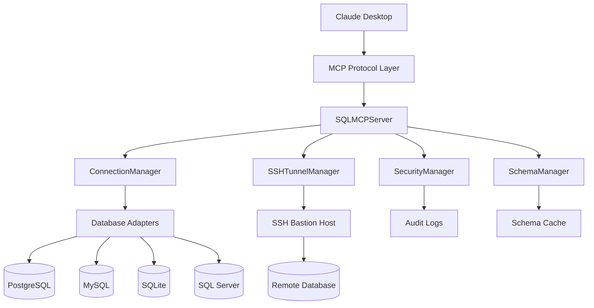
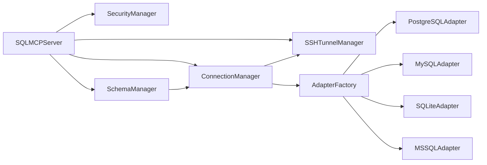
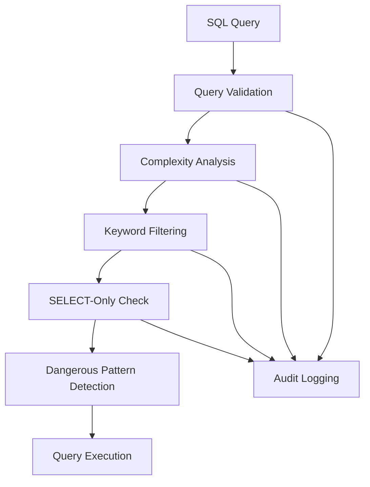
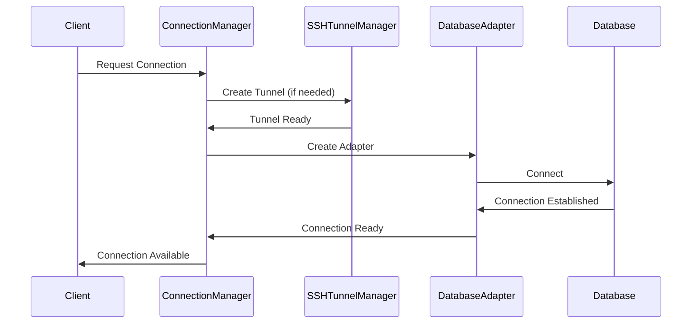
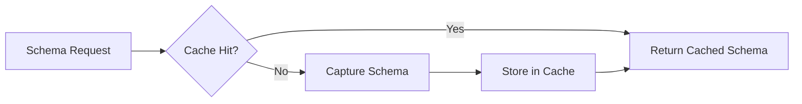
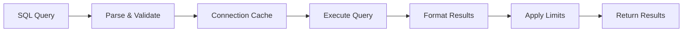

# System Architecture

The SQL MCP Server follows a layered, modular architecture designed for security, performance, and maintainability. This document provides a comprehensive overview of the system design, component interactions, and architectural decisions.

## High-Level Architecture



## Architectural Layers

### 1. Protocol Layer
**Responsibility**: MCP protocol communication and message handling

- **MCP Message Processing**: Handles JSON-RPC 2.0 messages over stdio
- **Tool Registration**: Exposes database tools to Claude Desktop
- **Request Routing**: Routes tool calls to appropriate handlers
- **Error Handling**: Standardized error responses and recovery

**Key Components**:
- `SQLMCPServer` - Main protocol handler
- Message validation and parsing
- Tool schema definitions
- Response formatting

### 2. Service Layer
**Responsibility**: Business logic and coordination between components

- **Connection Management**: Database connection lifecycle
- **Security Enforcement**: Query validation and access control
- **Schema Management**: Database metadata caching
- **SSH Tunneling**: Secure remote database access

**Key Components**:
- `ConnectionManager` - Connection pooling and lifecycle
- `SecurityManager` - Query validation and security
- `SchemaManager` - Schema discovery and caching
- `SSHTunnelManager` - SSH tunnel management

### 3. Data Access Layer
**Responsibility**: Database-specific implementations and abstractions

- **Database Adapters**: Unified interface for different databases
- **Query Execution**: SQL query processing and result handling
- **Schema Discovery**: Database metadata extraction
- **Connection Pooling**: Efficient connection management

**Key Components**:
- `AdapterFactory` - Database adapter creation
- `PostgreSQLAdapter`, `MySQLAdapter`, `SQLiteAdapter`, `MSSQLAdapter`
- Database-specific query builders
- Connection pooling implementations

### 4. Infrastructure Layer
**Responsibility**: Cross-cutting concerns and utilities

- **Configuration Management**: Config loading and validation
- **Logging and Monitoring**: Structured logging and metrics
- **Error Handling**: Centralized error processing
- **Type Safety**: Comprehensive TypeScript definitions

**Key Components**:
- Configuration parsers and validators
- Logger with structured output
- Error classes and handlers
- TypeScript type definitions

## Component Interactions

### Request Flow
1. **Claude Desktop** sends MCP request via stdio
2. **SQLMCPServer** receives and validates the request
3. **SecurityManager** validates query permissions and complexity
4. **SSHTunnelManager** establishes tunnels if needed
5. **ConnectionManager** gets/creates database connection
6. **Database Adapter** executes query against target database
7. **SchemaManager** caches metadata if needed
8. **Response** formatted and sent back to Claude

### Component Dependencies



## Security Architecture

### Defense in Depth
The system implements multiple layers of security:

1. **Query Validation**: SQL parsing and keyword filtering
2. **Complexity Analysis**: Query complexity scoring and limits
3. **SELECT-Only Mode**: Optional read-only database access
4. **Connection Isolation**: Separate connections per database
5. **SSH Tunneling**: Encrypted remote database access
6. **Audit Logging**: Comprehensive query and access logging

### Security Components



## Database Adapter Pattern

### Adapter Interface
All database adapters implement a common interface for consistent behavior:

```typescript
interface DatabaseAdapter {
 connect(): Promise<DatabaseConnection>
 disconnect(connection: DatabaseConnection): Promise<void>
 executeQuery(connection: DatabaseConnection, query: string, params?: unknown[]): Promise<QueryResult>
 captureSchema(connection: DatabaseConnection): Promise<DatabaseSchema>
 buildExplainQuery(query: string): string
 isConnected(connection: DatabaseConnection): boolean
}
```

### Database-Specific Implementations
Each adapter handles database-specific:
- Connection configuration and pooling
- Query parameter binding
- Result set formatting
- Schema metadata extraction
- Performance analysis queries

### Adapter Factory
The `AdapterFactory` provides:
- Dynamic adapter creation based on database type
- Configuration validation
- Error handling standardization
- Type safety across all adapters

## Connection Management

### Connection Lifecycle


### Connection Pooling Strategy
- **Per-Database Pools**: Each database maintains its own connection pool
- **Lazy Initialization**: Connections created on first use
- **Health Monitoring**: Regular connection health checks
- **Automatic Cleanup**: Idle connection cleanup and resource management

### SSH Tunnel Management
For secure remote database access:
- **On-Demand Tunnels**: Created when needed, cleaned up when idle
- **Key and Password Auth**: Support for both authentication methods
- **Port Management**: Automatic local port assignment
- **Tunnel Monitoring**: Health checks and automatic reconnection

## Schema Management

### Schema Caching Strategy


### Schema Discovery Process
1. **Table Discovery**: Find all tables and views
2. **Column Analysis**: Extract column metadata
3. **Relationship Mapping**: Identify foreign keys and relationships
4. **Index Information**: Gather index and constraint data
5. **Caching**: Store structured schema for fast access

### Performance Optimizations
- **Incremental Updates**: Only refresh changed schema elements
- **Background Refresh**: Asynchronous schema updates
- **Memory Management**: Efficient schema storage and retrieval
- **Compression**: Schema data compression for large databases

## Performance Architecture

### Query Execution Pipeline


### Performance Optimizations
- **Connection Pooling**: Reuse database connections
- **Result Set Limiting**: Configurable row limits
- **Schema Caching**: Avoid repeated metadata queries
- **Query Analysis**: Performance recommendations
- **Batch Operations**: Multiple queries in single request

### Resource Management
- **Memory Limits**: Result set size restrictions
- **Timeout Controls**: Query execution timeouts
- **Concurrent Requests**: Request queuing and throttling
- **Resource Cleanup**: Automatic connection and tunnel cleanup

## Module Organization

### Core Modules
```
src/
+-- classes/ # Core service classes
|   +-- SQLMCPServer.ts # Main MCP server
|   +-- ConnectionManager.ts # Connection management
|   +-- SecurityManager.ts # Security and validation
|   +-- SchemaManager.ts # Schema caching
|   +-- SSHTunnelManager.ts # SSH tunneling
+-- database/ # Database access layer
|   +-- adapters/ # Database-specific adapters
+-- types/ # TypeScript definitions
+-- utils/ # Utilities and helpers
+-- setup/ # Configuration and setup
```

### Separation of Concerns
- **Classes**: Business logic and service orchestration
- **Database**: Data access and database-specific code
- **Types**: Type definitions and interfaces
- **Utils**: Cross-cutting utilities and helpers
- **Setup**: Configuration and initialization code

## Event-Driven Architecture

### Event System
Components communicate via events for loose coupling:

```typescript
// Connection events
connectionManager.on('connected', (dbName: string) => {...})
connectionManager.on('disconnected', (dbName: string) => {...})
connectionManager.on('error', (error: Error, dbName?: string) => {...})

// SSH tunnel events
sshTunnelManager.on('tunnel-connected', (dbName: string) => {...})
sshTunnelManager.on('tunnel-disconnected', (dbName: string) => {...})

// Security events
securityManager.on('query-blocked', (dbName: string, reason: string) => {...})
securityManager.on('query-approved', (dbName: string) => {...})
```

### Event Benefits
- **Decoupling**: Components don't need direct references
- **Extensibility**: Easy to add new event listeners
- **Monitoring**: Centralized event handling for logging
- **Testing**: Events can be mocked for unit tests

## Configuration Architecture

### Configuration Hierarchy
1. **Default Values**: Hardcoded sensible defaults
2. **Configuration File**: `config.ini` file settings
3. **Environment Variables**: Runtime environment overrides
4. **Command Line Arguments**: Explicit parameter overrides

### Configuration Validation
- **Schema Validation**: Structured config validation
- **Type Checking**: TypeScript-enforced configuration types
- **Required Fields**: Validation of mandatory settings
- **Error Reporting**: Clear validation error messages

### Runtime Configuration
- **Hot Reload**: Configuration updates without restart
- **Validation**: Real-time configuration validation
- **Fallbacks**: Graceful handling of invalid configurations

## Design Principles

### SOLID Principles
- **Single Responsibility**: Each class has one clear purpose
- **Open/Closed**: Extensible through interfaces and inheritance
- **Liskov Substitution**: Database adapters are interchangeable
- **Interface Segregation**: Focused, minimal interfaces
- **Dependency Inversion**: Depend on abstractions, not concretions

### Additional Principles
- **Fail Fast**: Early validation and error detection
- **Defense in Depth**: Multiple security layers
- **Configuration Over Code**: Externalized configuration
- **Monitoring by Design**: Built-in logging and metrics
- **Type Safety**: Comprehensive TypeScript usage

## Quality Attributes

### Security
- Query validation and sanitization
- Access control and permissions
- Audit logging and monitoring
- Secure remote connections

### Performance
- Connection pooling and caching
- Query optimization suggestions
- Resource usage limits
- Efficient data structures

### Reliability
- Comprehensive error handling
- Graceful degradation
- Health checks and monitoring
- Automatic recovery mechanisms

### Maintainability
- Clear separation of concerns
- Comprehensive documentation
- Extensive test coverage
- Type safety throughout

### Scalability
- Stateless design
- Efficient resource usage
- Configurable limits
- Horizontal scaling support

---

This architecture provides a solid foundation for secure, performant, and maintainable database access from Claude Desktop while maintaining flexibility for future enhancements and extensions.